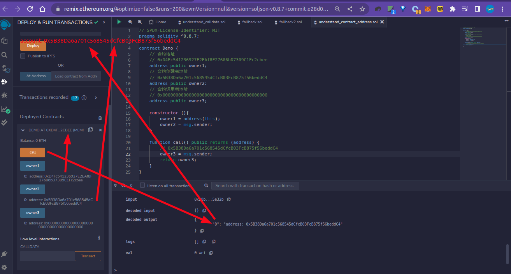
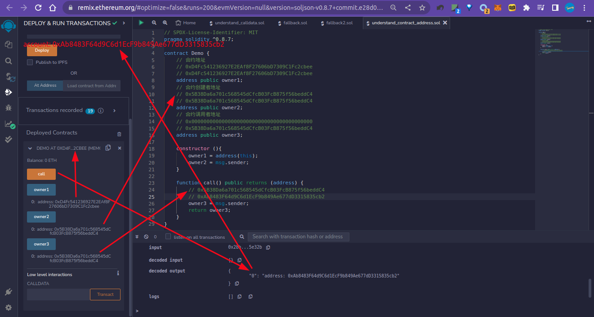
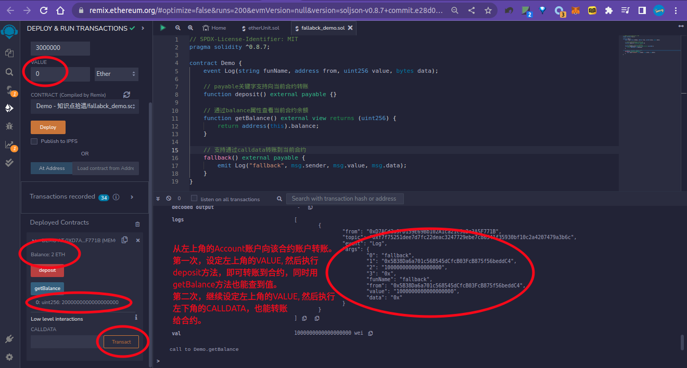
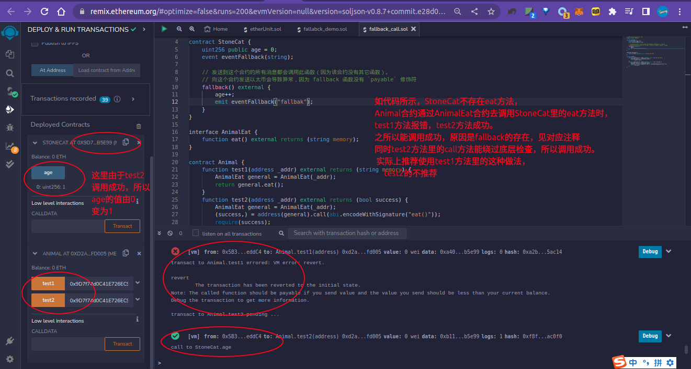
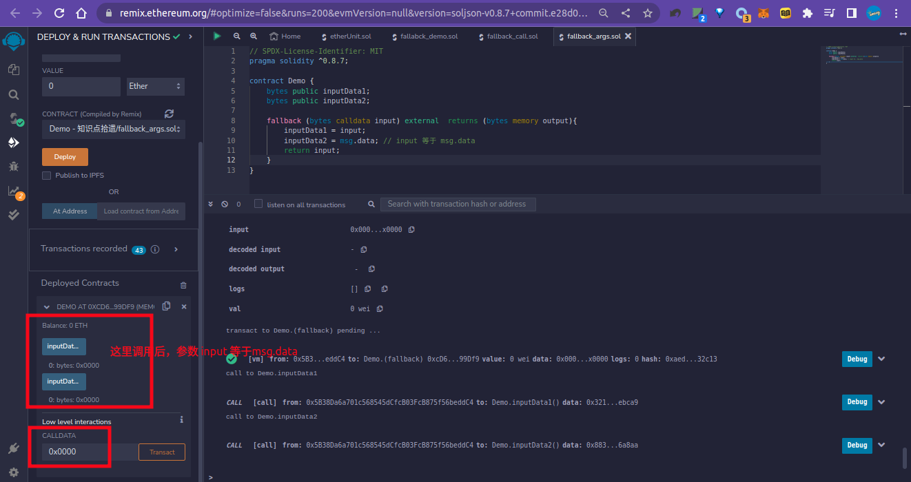
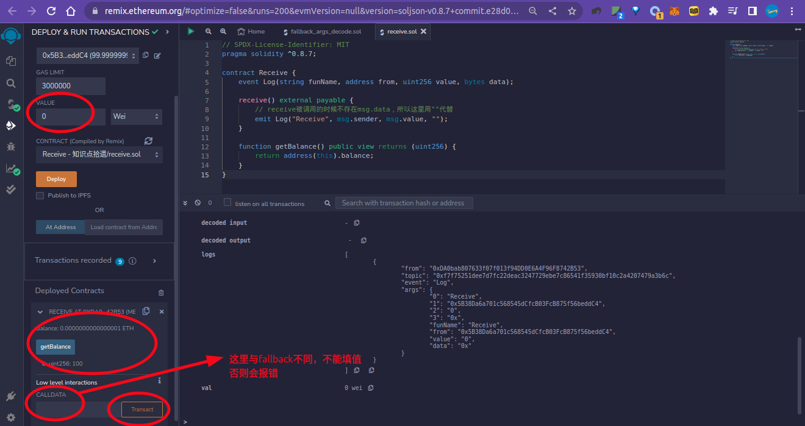
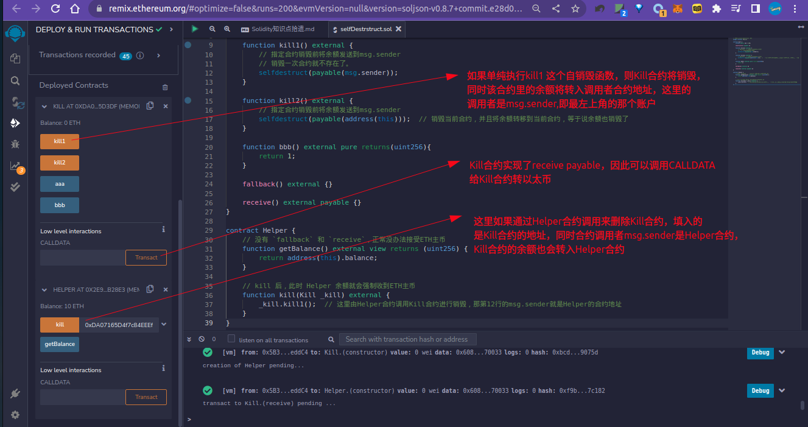

## 参考资料：

https://learnblockchain.cn/docs/solidity/index.html

https://www.axihe.com/solidity/professional-solidity/01.hello.html

https://www.yuque.com/amesy/pggt1g/nmu137

## 区块链基础

区块链无法保证当前交易一定包含在下一个区块中。

区块可能被回滚，交易可能被作废。

 ## 合约存储

无论外部地址，还是合约地址，对于 EVM 来说，都是一样的。每个地址都有一个键值对形式的持久化存储。其中 key 和 value 都是 256 位，我们称为存储。此外每个地址都会有一个以太币的余额，合约地址也是如此；余额会因为发送包含以太币的交易而改变。

**存储**：每一个地址都有一个持久化的内存，存储是将 256 位字映射到 256 位字的键值存储区。所以数据类型的最大值是 `uint256`/`int256`/`bytes32`（1bytes=8bit），合约只能读写存储区内属于自己的部分。

**内存**：合约会试图为每一次消息调用获取一块被重新擦拭干净的内存实例。所以储存在内存中的数据，在函数执行完以后就会被销毁。内存是线性的，可按字节级寻址，但读的长度被限制为 256 位，而写的长度可以是 8 位或 256 位。

**栈**：合约的所有计算都在一个被称为栈（stack）的区域执行，栈最大有 1024 个元素，每一个元素长度是 256 bit；所以调用深度被限制为 1024 ，对复杂的操作，推荐使用循环而不是递归。


Solidity 合约类似于面向对象语言中的类。合约中有用于数据持久化的状态变量，和可以修改状态变量的函数。 调用另一个合约实例中函数时，会切换执行时的上下文，此时前一个合约的状态变量就不能访问了。


 只要区块链网络支持EVM，Solidity合约代码就能在上面运行。


合约内的 `message` 叫做状态变量，状态变量是永久地存储在合约存储中的值。


`this` 关键字代表合约对象本身；

- 可以通过 `address(this)` 获取合约地址。
- 可以通过 `this.fnName` 获取 external 函数


合约地址/合约创建者地址/合约调用者地址:

   合约地址，在合约部署完成后生成，查看：address(this)

   合约创建者地址：在构造函数里面，通过msg.sender查看，该地址再不会变

   合约调用者地址：在一个函数里面调用msg.sender查看，谁调用，调用者地址就是谁。

   (以上可以看出，不同的方式调用msg.sender，得到的结果不同；同时扩展出构造函数被用来进行mint token，校验owner权限等。）

（msg.sender 是合约调用者地址，不同的调用者对应不同的地址；msg.value是该合约调用者每次转账的金额，每次转多少，msg.value就显示多少；CALLDATA 对应msg.data, CALLDATA传入啥(是个16进制的值)，msg.data就是啥）

代码示例：

```solidity
// SPDX-License-Identifier: MIT
pragma solidity ^0.8.7;

contract Demo {
    // 合约地址
    // 0xD4Fc541236927E2EAf8F27606bD7309C1Fc2cbee
    // 0xD4Fc541236927E2EAf8F27606bD7309C1Fc2cbee
    address public owner1;
    // 合约创建者地址
    // 0x5B38Da6a701c568545dCfcB03FcB875f56beddC4
    // 0x5B38Da6a701c568545dCfcB03FcB875f56beddC4
    address public owner2;
    // 合约调用者地址
    // 0x0000000000000000000000000000000000000000
    // 0x5B38Da6a701c568545dCfcB03FcB875f56beddC4
    address public owner3;

    constructor (){
        owner1 = address(this);
        owner2 = msg.sender;
    }

    function call() public returns (address) {
        // 0x5B38Da6a701c568545dCfcB03FcB875f56beddC4
        // 0xAb8483F64d9C6d1EcF9b849Ae677dD3315835cb2
        owner3 = msg.sender;
        return owner3;
    }
}
```

图示：

第一次调用：

Accouunt: 0x5B38Da6a701c568545dCfcB03FcB875f56beddC4



第二次调用：

Account: 0xAb8483F64d9C6d1EcF9b849Ae677dD3315835cb2




 不可以在构造函数内调用函数，因为此时合约还没有完成构建好。


合约属性:type 关键字

- `type(C).name`: 获得合约名
- `type(C).creationCode`:获得包含创建合约字节码的内存字节数组。它可以在内联汇编中构建自定义创建例程，尤其是使用 create2 操作码。 不能在合约本身或派生的合约访问此属性。 因为会引起循环引用。
- `type(C).runtimeCode`:获得合约的运行时字节码的内存字节数组。这是通常由 C 的构造函数部署的代码。 如果 C 有一个使用内联汇编的构造函数，那么可能与实际部署的字节码不同。 还要注意库在部署时修改其运行时字节码以防范定期调用（guard against regular calls）。 与 .creationCode 有相同的限制，不能在合约本身或派生的合约访问此属性。 因为会引起循环引用。

```solidity
// SPDX-License-Identifier: MIT
pragma solidity ^0.8.17;

contract Hello {
  string public message = "Hello World!";
}

contract Demo {
  function name() external pure returns (string memory) {
    return type(Hello).name;
  }

  function creationCode() external pure returns (bytes memory) {
    return type(Hello).creationCode;
  }
  function runtimeCode() external pure returns (bytes memory) {
    return type(Hello).runtimeCode;
  }
}
```


引用类型：需要 memory 限定

引用类型有：string、array、struct、mapping


接口：接口是智能合约的骨架，定义了合约的功能以及如何触发它们。

接口和库的代码示例：

```solidity
// SPDX-License-Identifier: MIT
pragma solidity ^0.8.7;

// Cat
contract Cat {
    function eat() public pure returns (string memory) {
        return "I'm Cat, I like to eat meat.";
    }
}

// Dog
contract Dog {
    function eat() public pure returns (string memory) {
        return "I'm Dog, I like to eat meat.";
    }
}

// 部署时，该接口不需要部署。
// 接口的作用是中转
// AnimalEat interface
interface AnimalEat {
    function eat() external returns (string memory);
}

// Animal
contract Animal {
    // 分别将Cat和Dog的部署后的合约地址传入此函数，将分别调用对应animal的eat方法
    function eat(address _addr) external returns (string memory) {
        AnimalEat animal = AnimalEat(_addr);
        return animal.eat();
    }

    // 返回接口，即函数选择器
    // 0x340a2a4e
    function getInterface() external pure returns (bytes4) {
        return type(AnimalEat).interfaceId;
    }

    function testSetLibrary() external pure returns (uint256) {
        return Set.testLibrary();  // 111
    }
}

library Set {
    function testLibrary() external pure returns (uint256) {
        return 111;
    }
}
```

## 全局的以太币单位

以太的最小单位是 `wei`, 如果后面没有单位，缺省为 `wei` 

以太币单位之间的换算就是在数字后边加上 `wei`、 `gwei`、 `ether` 来实现的。

- `1 ether = 1 * 10^18 wei`
- `1 ether = 1 * 10^9 gwei`

> **注意: 这些后缀不能直接用在变量后边**。
>
> 如果想用以太币单位来计算输入参数，可以使用乘法来转换: `amountEth * 1 ether`

代码示例：

```solidity
// SPDX-License-Identifier: MIT
pragma solidity ^0.8.7;

contract Unit {
    uint256 internal unitValue = 1;

    // wei
    function getWei() public view returns (uint256) {
        return unitValue + 1 wei;  // 1000000000000000001
    }
    
    // gwei
    function getGwei() public view returns (uint256) {
        return unitValue + 1 gwei;  // 1000000001
    }
    
    // ether
    function getEther() public view returns (uint256) {
        return unitValue + 1 ether;  // 2
    }
}
```


## 接收ETH

三个接收 ETH 相关的关键字：`payable`、`fallback`、`receive`

### payable

 `payable` 可以标记在方法上，表示该方法可以执行接收以太的操作；也可以标记在地址上，表示可以给该地址转钱。

```solidity
// 转账，默认会转到当前合约地址，因此可以通过这种方式存款
function deposit() external payable {}

function withdraw() external {
	// 将当前合约address(this)里的balance转给当前合约调用者msg.sender
	payable(msg.sender).transfer(address(this).balance);
}
```

通过 CALLDATA（网页版remix左侧最底下那个CALLDATA）调用会失败，但通过`fallback`就可以。

### fallback 

`fallback` 当合约中没有要调用的方法时，默认就会调用fallback；它还可以接收来自网络中的Token。

语法：

```solidity
fallback () external [payable] {}
fallback (bytes calldata input) external [payable] returns (bytes memory output) {}
```

代码示例：

```solidity
// SPDX-License-Identifier: MIT
pragma solidity ^0.8.7;

contract Demo {
	event Log(string funName, address from, uint256 value, bytes data);
	
	// payable关键字支持向当前合约转账
	function deposit() external payable {}
	
	// 通过balance属性查看当前合约余额
	function getBalance() external view returns (uint256) {
		return address(this).balance;
	}
	
	// 支持通过CALLDATA转账到当前合约
	// 注意，如果要通过CALLDATA转账，则需要fallback实现payable才可以。
	fallback() external payable {
		emit Log("fallback", msg.sender, msg.value, msg.data);
	}
}
```

图示：




fallback 执行合约不存在的方法：

代码示例：

```solidity
// SPDX-License-Identifier: MIT
pragma solidity ^0.8.7;

contract StoneCat {
    uint256 public age = 0;
    event eventFallback(string);

    // 发送到这个合约的所有消息都会调用此函数（因为该合约没有其它函数）。
    // 向这个合约发送以太币会导致异常，因为 fallback 函数没有 `payable` 修饰符
    fallback() external {
        age++;
        emit eventFallback("fallbak");
    }
}

interface AnimalEat {
    function eat() external returns (string memory);
}

contract Animal {
    function test1(address _addr) external returns (string memory) {
        AnimalEat general = AnimalEat(_addr);
        return general.eat();
    }
    function test2(address _addr) external returns (bool success) {
        AnimalEat general = AnimalEat(_addr);
        (success,) = address(general).call(abi.encodeWithSignature("eat()"));
        require(success);
    }
}
```

图示：



**带参数的fallback** 

fallback 可以有输入值和输出值，但必须都是 `bytes` 类型的数据。

如果使用了带参数的版本，`input` 将包含发送到合约的完整数据，参数 input 等于`msg.data`，因此可以省略input参数，并且通过 `output` 返回数据。 返回数据不是 ABI 编码过的数据，相反，它返回不经过修改的数据。与任何其他函数一样，只要有足够的 gas 传递给它，回退函数就可以执行复杂的操作。

代码示例：

```solidity
// SPDX-License-Identifier: MIT
pragma solidity ^0.8.7;

contract Demo {
    bytes public inputData1;
    bytes public inputData2;

    fallback (bytes calldata input) external  returns (bytes memory output){
        inputData1 = input;
        inputData2 = msg.data; // input 等于 msg.data
        return input;
    }
}
```

图示：



如果想要解码输入数据，那么前四个字节用作函数选择器，然后用`abi.decode` 与数组切片语法一起使用来解码 ABI 编码的数据：`(c, d) = abi.decode(_input[4:], (uint256, uint256));` 

请注意，这仅应作为最后的手段，而应使用对应的函数。

```solidity
// SPDX-License-Identifier: MIT
pragma solidity ^0.8.7;

contract StoneCat {
    uint256 public age = 0;
    bytes public inputData1;
    bytes public inputData2;
    uint256 public c;
    uint256 public d;

    event eventFallback(string);

    fallback (bytes calldata input) external  returns (bytes memory output){
        age++;
        inputData1 = input;
        inputData2 = msg.data;
        (c, d) = abi.decode(msg.data[4:], (uint256, uint256));  
        emit eventFallback("fallbak");
        return input;
    }
}

interface AnimalEat {
    function eat() external returns (string memory);
}

contract Animal {
    function test2(address _addr) external returns (bool success) {
        AnimalEat general = AnimalEat(_addr);
        (success, ) = address(general).call(abi.encodeWithSignature("eat()",123,456));
        require(success);
    }
}
```

### receive

只负责接收主币。

语法：`receive() external payable{}` , 其中payable是必须的。

receive 和 fallback 在被继承的时候都可以被重载。

receive 最好不要执行太多的逻辑, 因为如果别人用send和transfer方法发送 ETH 的话，gas 会限制在 2300，receive 太复杂可能会触发 Out of Gas 报错；如果用call就可以自定义gas执行更复杂的逻辑。	

fallback 也是，加payable会限制gas为2300，几乎做不了什么，因此能不加payable就不要加。

代码示例：

```solidity
// SPDX-License-Identifier: MIT
pragma solidity ^0.8.7;

contract Receive {
    event Log(string funName, address from, uint256 value, bytes data);

    receive() external payable {
        // receive被调用的时候不存在msg.data，所以这里用""代替
        emit Log("Receive", msg.sender, msg.value, "");
    }

    function getBalance() public view returns (uint256) {
        return address(this).balance;
    }
}
```

图示：



fallback 和 receive 推荐的写法如下：

> 如果 fallback 加上 payable， 再去掉 receive 的话会报 warning.

```solidity
receive() external payable {}


// SPDX-License-Identifier: MIT
pragma solidity ^0.8.7;

contract Receive {
    event Log(string funName, address from, uint256 value, bytes data);

    receive() external payable {
        // receive被调用的时候不存在msg.data，所以这里用""代替
        emit Log("Receive", msg.sender, msg.value, "");
    }
    
    // fallback不加pabable，只用来垫底；receive加上payable，用来接收token
    fallback() external {}

    function getBalance() public view returns (uint256) {
        return address(this).balance;
    }
}
```

fallback 和 receive 共存的调用，按如下规则：

```
触发fallback() 还是 receive()?
           接收ETH
              |
         msg.data是空？ // 即 CALLDATA没有值
            /  \
          是    否
          /      \
receive()存在?   fallback()
        / \
       是  否
      /     \
receive()   fallback()
```

代码示例：

```Solidity
// SPDX-License-Identifier: MIT
pragma solidity ^0.8.7;

// 这个合约会保留所有发送给它的以太币，没有办法返还。
contract Demo {
    uint256 public x;
    uint256 public y;

    event Log(string funName, address from, uint256 value, bytes data);

    // 纯转账调用这个函数，例如对每个空的CALLDATA的调用
    // 注意gas被限制为2300
    receive() external payable {
        x = 1;
        y = msg.value;
        emit Log("receive", msg.sender, msg.value, "");
    }

    // 除了纯转账外，所有的调用都会调用这个函数．
    // (因为除了 receive 函数外，没有其他的函数).
    // 任何对合约非空CALLDATA调用会执行回退函数(即使是调用函数附加以太).
    fallback() external payable {
        x = 2;
        y = msg.value; 
        emit Log("fallback", msg.sender, msg.value, msg.data);
    }

    /*
    // fallback里的payable可以不加，但是去掉payable的话msg.value等也要跟着去掉，否则会报错：
    // "msg.value" and "callvalue()" can only be used in payable public functions
    fallback() external {
        x = 2;
    }
    */

    function getBalance() external view returns (uint256) {
        return address(this).balance;
    }

    // receive 和 fallback 里的 x、y 在不同作用域，互不影响；但是转到合约账户里的金额是累加到一起的
    // 如果没有receive，则永远只执行fallback, 无论是转账还是其他相关。
}
```

## selfdestruct 自毁合约

合约代码从区块链上移除的唯一方式是合约在合约地址上执行自毁操作: `selfdestruct` 。

`selfdestruct` 作用是 **销毁合约**，并**把余额发送到指定地址类型 Address**。

如果接受的地址是合约，即使里面没有 `fallback` 和 `receive` 也会发送过去。

代码示例：

```solidity
// SPDX-License-Identifier: MIT
pragma solidity ^0.8.7;

contract Kill {
    uint256 public aaa = 123;

    constructor() payable {}

    function kill1() external {
        // 指定合约销毁前将余额发送到msg.sender
        // 销毁一次合约就不存在了。
        selfdestruct(payable(msg.sender));
    }

    function kill2() external {
        // 指定合约销毁前将余额发送到msg.sender
        selfdestruct(payable(address(this)));  // 销毁当前合约，并且将余额转移到当前合约，等于说余额也销毁了
    }

    function bbb() external pure returns(uint256){
        return 1;
    }

    fallback() external {}

    receive() external payable {}
}

contract Helper {
    // 没有 `fallback` 和 `receive`，正常没办法接受ETH主币
    function getBalance() external view returns (uint256) {
        return address(this).balance;
    }

    // kill 后，此时 Helper 余额就会强制收到ETH主币
    function kill(Kill _kill) external {
        _kill.kill1();  // 这里由Helper合约调用Kill合约进行销毁，那第12行的msg.sender就是Helper的合约地址
    }
}
```

图示：



## 常数

两个关键字，constant（常量）和immutable（不变量）。

状态变量声明这个两个关键字之后，不能在合约后更改数值，还可以节省gas。

另外，只有**数值变量**可以声明 constant 和 immutable；**string** **和** **bytes** 可以声明为constant，但不能为immutable。

## pure、view

pure、view 并不是针对的函数入参，而是该函数处理的相关状态变量。

代码示例：全局变量也遵循是否支持读写

```solidity
function transfer() public view returns (uint256) {  // 必须是view， 如果是pure会报错
	return address(this).balance;
}
```

注意这种情况：

```solidity
function test() public pure returns (uint) {  // 编译器提示必须要加pure
    uint m = 10;
    return m;
}
```

## 函数

语法：

```Solidity
function (<parameter types>) {internal|external} [pure|constant|view|payable] [returns (<return types>)]
```

函数类型有两类：- 内部（internal）函数和 外部（external） 函数：

**内部函数只能在当前合约内被调用**（更具体来说，在当前代码块内，包括内部库函数和继承的函数中），因为它们不能在当前合约上下文的外部被执行。 调用一个内部函数是通过跳转到它的入口标签来实现的，就像在当前合约的内部调用一个函数。


## Solidity数据类型基础

Solidity: 这门合约语言就是功能和数据的集合。

它是静态强类型语言 

赋值的状态变量，存在于支持EVM虚拟机的链上。

变量类型要与所赋的值匹配上，并且变量类型支持隐式转换，比如整型。

## 值类型和引用类型

Solidity 按照数据类型可以分为**值类型**和**引用类型**。

- 值类型: 传值时会将值拷贝一份，传递的是值本身，对其修改时并不会对原来值有影响。

    - 始终按值来传递，当被用作函数参数或者用在赋值语句中时，总会进行值拷贝。

    - 值类型里有两个比较特殊的类型是 **函数** 和 **地址** （包括合约）。

- 引用类型: 传递的是其指针，而引用类型传递时**可以为值传递** (storage限定)，**也可以为引用传递** (memory限定) 。

    - 引用类型可设置storage和memory，限定对应变量在全局有效(storage)，还是在函数内或在内存中有效(memory)

代码示例：

```solidity
// SPDX-License-Identifier: MIT
pragma solidity ^0.8.17;

contract Demo {
    uint256 public u = 123; // 无变化
    string public welcome1 = "Hello";
    string public welcome2 = "Hello";

    function test() external returns(uint256,string memory,string memory){
        // 修改值类型
        uint256 x = u; // 赋值
        x = 1; // 修改

        // 修改引用类型
        string storage hi1 =  welcome1; // 赋值
        bytes(hi1)[0] = bytes1("2");  // welcome1的值变为: 2ello

        string memory hi2 =  welcome2; // 赋值
        bytes(hi2)[0] = bytes1("2");  // welcome2的值变为: Hello

        // 返回值
        return(x,hi1,hi2);
    }
}
```

## 布尔类型

支持其他语言里的 &&、||、等等。

减少变量赋值可以省gas

短路操作可以省gas, 即在有判断的情况下，比如通过&&短路运算符，把容易判断的放在&&左边，当判断出来后，可能就不再判断&&右边的值了，可以省gas。

## 整数类型

- 整型

    - 无符号
        - uint8 to uint256
        - uint: uint 和 uint256相同
    - 有符号
        - int8 to int256
        - int: int 与 int256 相同。

    > 1、`uint` 和 `int` 分别是 `uint256` 和 `int256` 的别名。
    >
    > 2、uint8 to uint256，中间以8的倍数增加，即uint8、uint16、uint24、uint32、...、uint256。int8 to int256同理。
    >
    > (byte/bit, 换算关系为：1byte=8bit，且EVM规定值的最大长度为256位)
    >
    > (因为8bit=1byte, 因此uint256可以转换为byte就是bytes32, 其他同理，比如uint8 => bytes1, uint16 => bytes2)
    >
    > 3、获取类型的最大值和最小值：type(T).max、type(T).min, 比如type(uint32).max
    >
    > 4、对于无符号整型，它的某个类型的最大值为 2^n-1，比如uint32的最大值为 2的32次方减一，即4294967295。之所以要减去1，是因为这个1对应的是符号位（符号位的1表示正值，0表示负值）。最小值则都为0.
    >
    > 5、对于有符号整型，它的某个类型的最大值为 (2^n)/2-1, 最小值为负的(2^n)/2
    >
    > 6、对于常用类型需要记得它的最大值，反之只需要记得计算方法即可。
    
- 定长浮点型

    - 各种大小的无符号的定长浮点型
        - unfixed
    - 各种大小的有符号的定长浮点型
        - fixed

```
Solidity 还没有完全支持定长浮点型。浮点型使用频率非常低。

可以声明定长浮点型的变量，但不能给它们赋值或把它们赋值给其他变量。。

可以通过用户定义的值类型的 wrap / unwrap 来模拟出来，后面介绍用户自定义类型时候会介绍。

fixed / ufixed：表示各种大小的有符号和无符号的定长浮点型。 在关键字 ufixedMxN 和 fixedMxN 中，M 表示该类型占用的位数，N 表示可用的小数位数。 M 必须能整除 8，即 8 到 256 位。 N 则可以是从 0 到 80 之间的任意数。
```


### checked和unchecked模式

视频参考：https://www.bilibili.com/video/BV1HR4y197Ag?p=16&vd_source=23839cf8f51d3465d92624d05d7db743

出现在0.8.0之后的版本，用于检测算术运算结果溢出。

默认情况下，算术运算都处在 `checked` 模式下，即都会进行溢出检查，如果结果落在取值范围之外，调用会通过 失败异常 回退。也可以通过 `unchecked{ ... }` 切换到 “unchecked”模式。

代码示例：

```solidity
// SPDX-License-Identifier: MIT
pragma solidity ^0.8.7;

contract C {
    uint256 public a = type(uint256).max;
    uint8 public b = 1;

    function f1() public view returns (uint256) {
        // 减法溢出会返回“截断”的结果
        unchecked {
            return a + b;
        }
    }

    function f2() public view returns (uint256) {
        unchecked {
            return a + 2;
        }
    }

    function g() public view returns (uint256) {
        // 溢出会抛出异常
        return a + b;
    }
}
```

`unchecked` 代码块可以在代码块中的任何位置使用，但不可以替代整个函数代码块，同样不可以嵌套。此设置仅影响语法上位于 `unchecked` 块内的语句。 在块中调用的函数不会此影响。

注意事项：

1. 为避免歧义，不能在 unchecked 块中使用 `_;`, 该表示方法仅用于函数修改器。
2. unchecked {} 不能嵌套，即不支持unchecked嵌套unchecked。
3. 取模运运算，比如 `1 / 0` 这种不能使用unchecked, 会发生 `Panic` 错误。
4. 位运算不会执行上溢或下溢检查。
5. 负负得正的情况，比如 `int x = type(int).min; -x;` 中的第 2 句会溢出 (可通过加unchecked{}解决)，因为负数的范围比正整数的范围大 1。

### 字面常量

整数字面常量用 "_" 增加可读性，如 `int public a = -1_123_1_123`, 编译出的结果为 -11231123。

但是下划线不能加到值的开头或末尾。

### 字面常量支持任意精度

加数和被加数即使非常大，但只要结果落在接收变量对应类型的范围内，即使是小数，都合法。

特殊情况：

```
uint128 a = 1;
uint128 b = 2.5 + 0.5 + a;  // 正确，结果为4
// uint128 b = 2.5 + a + 0.5;  // 报错，计算时不能将两个浮点数隔开
```

### 除法截断

在智能合约中，在 字面常量 会保留精度（保留小数位）。

整数的除法会被截断（例如：`1/4` 结果为 0）,但是使用字面量的方式不会被截断。

代码示例：

```solidity
uint256 a = 1;
uint256 b = 4;
uint256 c1 = (1 / 4) * 4; // 值为1 => 未截断， 即(1 / 4) * 4 => 0.25 * 4 => 1
uint256 c2 = (a / b) * b; // 值为0 => 截断， 即(a / b) * b => 0 * 4 => 0
```

注：表达式 `type(int).min / (-1)` 是仅有的整除会发生向上溢出的情况。 在算术检查模式下，这会触发一个失败异常，在截断模式下，表达式的值将是 `type(int).min` 。

代码示例：

```solidity
function test1() public pure returns (int256) {
    // 报错revert
    // int256 vv = type(int256).min / (-1);
    // return vv;

    // 正确执行
    unchecked {
        int256 vv = type(int256).min / (-1);
        return vv;
    }
}
```

### 优先使用较小类型计算

虽然大多数运算符在字面常量运算时都会产生一个字面常量表达式，但有一些运算符并不遵循这种模式：

- 三元运算符 `(... ? ... : ...)`,
- 数组下标访问 (`<array>[<index>]`).

像`255 + (true ? 1 : 0)` 或 `255 + [1, 2, 3][0]` 这样的表达式是在 `uint8` 类型中计算的，会溢出。并不是直接使用 256 字面常量。

代码示例：

```Solidity
// VM error: revert.
function testA1() public pure returns (uint256 a) {
    a = 255 + (true ? 1 : 0);  // 1被推倒为uint8, 计算得到的结果为256发生溢出，故报错
}

// VM error: revert.
function testA2() public pure returns (uint256 a) {
    a = (true ? 1 : 0) + 255;
}

// VM error: revert.
function testB1() public pure returns (uint256 a) {
    a = 255 + [1, 2, 3][0];
}
// VM error: revert.
function testB2() public pure returns (uint256 a) {
    a = [1, 2, 3][0] + 255;
}

// OK
function testA3() public pure returns (uint256 a) {
    a = 255 + uint256(true ? 1 : 0);  // 显式转换一下就OK了
}
// OK
function testB3() public pure returns (uint256 a) {
    a = 255 + uint256([1, 2, 3][0]);
}
```

### 类型转换

显式类型转换将始终截断并且不会导致失败的断言，但是从整数到枚举类型的转换例外。

```
// 115792089237316195423570985008687907853269984665640564039457584007913129639935
uint256 public a = type(uint256).max;  
// 255
uint8 public b = uint8(a);  // 显式类型转换
// uint8 public b = a;  // 隐式类型转换会报错
```

## 定长字节类型

定义方式： `bytesN`，其中 N 可取 `1~32` 中的任意整数。

- bytes1 ~ bytes32

bytesN 和bytes 不同：

	- `bytesN`: 是定长的字节数组，是**值类型**。
	- `bytes`: 是变长字节数组，是**引用类型**。

注：定长字节数组一旦声明，其内部的字节长度不可修改。

普通赋值代码示例：

```solidity
// SPDX-License-Identifier: MIT
pragma solidity ^0.8.17;

contract Test {
    // 固定长度的字节数组
    bytes1 public a1 = 0x61;
    bytes2 public a2 = 0x6100;
    bytes4 public a3 = 0x61000000;
    bytes6 public a4 = 0x416e62616e67;
    bytes7 public a5 = 0x416e62616e6700;
    bytes8 public a6 = 0x416e62616e670000;
    bytes16 public a7 = 0x416e62616e6700000000000000000000;
    bytes32 public a8 = 0x416e62616e670000000000000000000000000000000000000000000000000000;
}
```

注意这里 `bytes32` 和 `bytes` 是不同的。`bytes` 是变长字节数组，是引用类型。

使用字符串赋值：

```solidity
// SPDX-License-Identifier: MIT
pragma solidity ^0.8.7;

contract Test {
	// 16进制转换
	// 字符串会转成16进制的字节数组
    bytes1 public b1 = "a";  // 0x61
    bytes2 public b2 = "a";  // 0x6100
    bytes4 public b3 = "a";  // 0x61000000
    bytes6 public b4 = "abcd";  // 0x616263640000
    bytes7 public b5 = "abcd";  // 0x61626364000000
    bytes8 public b6 = "abcd";  // 0x6162636400000000
    bytes16 public b7 = "abcd";  // 0x61626364000000000000000000000000
    bytes32 public b8 = "abcd";  // 0x6162636400000000000000000000000000000000000000000000000000000000
}
```

属性：

- length  （只读）
    - 返回字节个数，可以通过索引读取对应索引的字节。
- 索引访问: `bytesN[index]` 
    - index 取值范围`[0, N]`，其中 N 表示长度。
    - **如果 `x` 是 `bytesI` 类型，那么 `x[k]` （其中 0 <= k < I）返回第 k 个字节（只读）。**

代码示例：

```Solidity
// SPDX-License-Identifier: MIT
pragma solidity ^0.8.17;

contract Test {
    // 固定长度的字节数组
    bytes1 public a1 = 0x61;
    bytes2 public a2 = 0x6100;

    // length
    uint256 public n1 = a1.length;
    uint256 public n2 = a2.length;

    // 索引
    function getIndex(uint8 index_) public view returns(bytes1){
        return a2[index_];
    }

    // 不可以修改
    // function setIndex(uint8 index_,bytes1 value_) public view{
    //     a2[index_] = value_;
    // }
}	
```

## 字符串字面常量及类型

单纯的字符串是引用类型。这是针对字符串变量而言的。也就是赋值运算符等号的左边。

但字符串字面常量是值类型。这是针对赋值的字符的字面而言的。也就是赋值运算符等号的右边。

> 字符串字面常量在赋值给bytesN时会被解释为原始的字节形式 (0xaaaa这种)。

代码示例：

```solidity 
contract Test {
    bytes1 public b1 = "a";
    string public b2 = "a";
}
```

### 转义字符

> - `\'` (单引号)
> - `\"` (双引号)
> - `\\` (反斜杠)
> - `\<newline>` (转义实际换行)
> - `\b` (退格)
> - `\f` (换页)
> - `\n` (换行符)
> - `\r` (回车)
> - `\t` (标签 tab)
> - `\v` (垂直标签)
> - `\xNN` (十六进制转义，见下文)
> - `\uNNNN` (unicode 转义，见下文)

###  用空格分开的字符串

用空格分开的 `"foo" "bar"` 等效于 `"foobar"` 。

代码如下：

```Solidity
string public a = "a" "b" "c";  // 结果为abc
```

## 十六进制字面常量 

十六进制字面常量以关键字 `hex` 打头，后面紧跟用单引号或双引号包裹起来的字符串 (例如 hex"61")。

代码示例：

```Solidity
bytes2 public x = "a";          // 0x6100   
bytes2 public y = 0x6100;       // 0x6100
bytes2 public z = hex"6100";    // 0x6100
```

用空格分开的十六进制字面常量：

字符串之间的比较有点特殊, 需要用 `keccak256(abi.encode())` 方法包裹一下。

```Solidity
bytes3 public a = "a" "b" "c";  // 0x616263
bytes3 public b = "abc";  // 0x616263

string public c = "a" "b" "c";  // abc
string public d = "abc";  // abc

// 比较值是否相等
bool public result_bytes3 = (a == b);  // true
bool public result_string = ((keccak256(abi.encode(c)) == keccak256(abi.encode(d))));  // true
```

## Unicode 字面常量

常规字符串文字只能包含 ASCII (比如 "abc123")，而 Unicode 文字 (比如"同志们好")（以关键字 unicode 为前缀）可以包含任何有效的 UTF-8 序列。 它们还支持与转义序列完全相同的字符作为常规字符串文字。

代码示例：`string  public a = unicode"同志们好";`  

## 枚举 enum

`enum` 是一种用户自定义类型，用于表示多种状态，枚举可用来创建由一定数量的“常量值”构成的自定义类型。

枚举默认值是第一个成员，所以枚举类型至少需要一个成员，枚举不能多于 256 个成员（因为最大的常量值是int256/uint256）。**枚举默认的类型为 `uint8`，当枚举数足够多时，它会自动扩大, 如 `uint16`..等。**可以通过 remix 部署后在函数的输入值内查看类型 `uint8` / `uint16`/...。

- 枚举类型，返回值是索引，默认值是 0;
- 枚举类型的默认值是第一个值。
    - 枚举类型 enum 至少应该有一名成员。
- 设置的时候，可以设置为索引，也可以对应的枚举名称;
- **枚举类型 enum 可以与整数进行显式转换，但不能隐式转换。**
    - 显式转换会在运行时检查数值范围，如果不匹配，将会引起异常。

枚举还可以在合约或库定义之外的文件级别上声明。

**属性：** 数据用从`0`开始的无符号整数值表示。

**方法：**

- delete
- `type(NameOfEnum).min`  
- `type(NameOfEnum).max`
    - max和min没测试成功，以后遇到再研究，先mark。

代码示例：

```solidity
// SPDX-License-Identifier: MIT
pragma solidity ^0.8.7;

contract Enum {
    // 枚举类型的默认值是第一个值。
    enum Status {
        None,//0
        Pending,//1
        Shiped,//2
        Completed,//3
        Rejected,//4
        Canceled// 5
    }

    Status public status;

    // 由于枚举不属于ABI的一部分，因此对于所有来自Solidity外部的调用时，
    // 此处的getStatus()的签名会自动被改成"getStatus() returns (uint8)"。
    function getStatus() public view returns (Status) {
        return status;  // 结果为0，类型为uint8
    }

    // 获取status的默认值
    function getDefaultStatus() public view returns (uint256) {
        return uint256(status);  // // 结果为0，类型为uint256
    }

    // 手动传入status
    // 该值在交易中能查看到，因此不需要额外写return
    function setStatus(Status value) public {
        status = value;
    }

    // 手动指定status
    // 这里需要额外写return，然后指定的值在交易中才能查看到
    function setStatusValue() public returns (Status) {
        status = Status.Rejected;
        return status;
    }

    // 删除枚举值
    // 删除后，不管删除前status的值是几，此时都会被置为0
    function deleteEnum() public returns (Status) {
        status = Status.Canceled;
        delete status;
        return status;
    }
    
    /*
     *status定义在全局，所以每个函数用到status且进行值操作时，status会在全局范围内更新
	*/
}
```

## 用户定义的值类型

Solidity 允许在一个基本的值类型上创建一个零成本的抽象。这类似于一个别名，但有更严格的类型要求。

用户定义值类型使用 `type UserType is DefaultType` 来定义。

> `UserType` 是新引入的类型的名称， `DefaultType` 必须是内置的值类型（”底层类型”）。自定义类型的值的数据表示则继承自底层类型，并且 ABI 中也使用底层类型。

用户定义的类型 `UserType` 没有任何运算符或绑定成员函数。即使是操作符 `==` 也没有定义。也不允许与其他类型进行显式和隐式转换。因为没有加减乘除等运算操作，所以UserType计算时要通过`UserType.unwrap()` 转换成基本值类型。

方法：

- `UserType.wrap()`: 用来从底层类型转换到自定义类型
    - 比如 uint256 => 自定义
- `UserType.unwrap()`: 从自定义类型转换到底层类型。
    - 比如 自定义 => uint256

代码示例：

```Solidity 
// SPDX-License-Identifier: MIT
pragma solidity ^0.8.17;

// 使用用户定义的值类型表示 18 位小数、256 bit的浮点类型。
type UFixed256x18 is uint256;  // 这一行我测试在0.8.7版本下会报错，使用最新的0.8.17则没问题。

/// 在 UFixed256x18 上进行浮点操作的精简库。
library FixedMath {
    uint constant multiplier = 10**18;

    /// 两个 UFixed256x18 数相加，
    /// 溢出时恢复，依赖于 uint256 上的检查算术
     function add(UFixed256x18 a, UFixed256x18 b) internal pure returns (UFixed256x18) {
        return UFixed256x18.wrap(UFixed256x18.unwrap(a) + UFixed256x18.unwrap(b));
    }
    /// 将 UFixed256x18 和 uint256 相乘.
    /// 溢出时恢复，依赖于 uint256 上的检查算术
     function mul(UFixed256x18 a, uint256 b) internal pure returns (UFixed256x18) {
        return UFixed256x18.wrap(UFixed256x18.unwrap(a) * b);
    }
    ///  UFixed256x18 向下取整.
    /// @return 不能超过 `a` 的最大整数。
    function floor(UFixed256x18 a) internal pure returns (uint256) {
        return UFixed256x18.unwrap(a) / multiplier;
    }
    /// 将 uint256 转换为相同值的 UFixed256x18。
    /// 如果整数太大，则还原。
    function toUFixed256x18(uint256 a) internal pure returns (UFixed256x18) {
        return UFixed256x18.wrap(a * multiplier);
    }
}
contract Test {
    uint256 a = 1;
    uint256 b = 2;

    function testAdd() public view returns (UFixed256x18) {
        return FixedMath.add(FixedMath.toUFixed256x18(a), FixedMath.toUFixed256x18(b));
    }
    
    function testMul() external view returns (UFixed256x18) {
        return FixedMath.mul(FixedMath.toUFixed256x18(a),b);
    }

    function testFloor() public view returns (uint256) {
        return FixedMath.floor(testAdd());
    }

    function testToUFixed256x18() external view returns (UFixed256x18) {
        return FixedMath.toUFixed256x18(testFloor());
    }
}
```

## 值类型：地址类型

地址分为外部地址和合约地址，每个地址都有**一块持久化内存区**称为存储。

**地址类型也是值类型。**

地址类型是 Solidity 语言独有的数据类型，表示以太坊的地址类型。用 address 表示地址，长度是 20 个字节；我们日常使用的是十六进制的地址格式，比如: `0xffD0d80c48F6C3C5387b7cfA7AA03970bdB926ac`；这种类型适合存储合约地址或外部地址。

### 地址字面量

通常的地址类型是 `0xffD0d80c48F6C3C5387b7cfA7AA03970bdB926ac` 这样的 [checksum address](https://github.com/ethereum/EIPs/blob/master/EIPS/eip-55.md)，。 而没有通过校验测试的长度在 39 到 41 个数字之间的十六进制字面常量会产生一个错误, 比如 `0xFFD0D80C48F6C3C5387B7CFA7AA03970BDB926AC` 就是一个错误 address 类型。在remix中会通过报错提示来知晓正确的地址，也可以将地址输入到 [etherscan](https://cn.etherscan.com/address/0xffD0d80c48F6C3C5387b7cfA7AA03970bdB926AC) 获取。（在url粘贴该地址，然后回车即可显示正确的checksum address）。

> checksum address是 [EIP-55](https://github.com/ethereum/EIPs/blob/master/EIPS/eip-55.md) 规范引入的机制，用于检测地址的准确性。 
>
> 对应业务程序也要有相应的 checksum 校验逻辑才行。通过 JS SDK 来自己转换 [web3.utils.toChecksumAddress(address)](https://web3js.readthedocs.io/en/v1.8.0/web3-utils.html#tochecksumaddress)

### address/uint/bytes32 之间的转换

- 1 字节等于 8 位，一个 address 是 20 个字节，是 160 位，所以 **address 可以用 uint160 表示**。
- **1 字节可以表示为两个连续的十六进制数字**，所以 **address 可以用连续的 40 个十六进制数字表示**。

> 整理如下：
>
> - 1 address = 20 byte = 160bit (uint160)
>
> - 1 byte = 2 hex，20 byte = 1 address = 40 hex

- address 不允许任何算数操作。

- address 允许和 uint160、 整型字面常量、bytes20 及合约类型相互转换。 如果将使用较大字节数组类型(例如 bytes32)转换为 address，那么 address 将被截断。

代码示例：

```solidity
// SPDX-License-Identifier: MIT
pragma solidity ^0.8.7;

contract Demo {
    bytes32 public a = "a";  // // 0x6100000000000000000000000000000000000000000000000000000000000000
    bytes32 public b = 0x111122223333444455556666777788889999AAAABBBBCCCCDDDDEEEEFFFFCCCC;

    // 较大数组类型转address
    // 0x6100000000000000000000000000000000000000
    address public add1 = address(uint160(bytes20(a)));

    // 注意看转换后的结果，从前往后进行截断
    // 0x111122223333444455556666777788889999aAaa
    address public add1_ = address(uint160(bytes20(b)));

    // 0x0000000000000000000000000000000000000000
    address public add2 = address(uint160(uint256(a)));

    // 注意看转换后的结果，从后往前进行截断
    // 0x777788889999AaAAbBbbCcccddDdeeeEfFFfCcCc
    address public add2_ = address(uint160(uint256(b)));
}
```

注意，网上很多在线转换工具得到的结果并不正确，比如: https://tool.oschina.net/hexconvert/ 

如下例子进行真实转换：`_owner` 在一些在线的软件内转换的不正确，上面的oschina网址有个小 BUG，输入十六进制数据的时候，不能带 `0x` 前缀。

```Solidity 
contract test {
    address _owner; // 十六进制
    uint160 _ownerUint; // 十进制

    constructor() {
        _owner = 0xffD0d80c48F6C3C5387b7cfA7AA03970bdB926ac;
        _ownerUint = 1460450021995508802976443037013257463744970696364;
    }

    function toUint160() public view returns (uint160) {
        //转换为10进制
        // 1460450021995508802976443037013257463744970696364
        return uint160(_owner);
    }

    function toAddress() public view returns (address) {
        // 转换为十六进制的address
        // 0xffD0d80c48F6C3C5387b7cfA7AA03970bdB926ac
        return address(_ownerUint);
    }
}
```

注意: 这里说的地址是 `0x123...` 这种十六进制的地址公钥，而不是应用层的 `amesy.eth` 这种 ENS 地址。虽然在很多钱包可以通过`amesy.eth`来向`0xffD0d80c48F6C3C5387b7cfA7AA03970bdB926ac`转账，但仅仅是应用层的中转服务。具体可以在 [以太坊浏览器](https://etherscan.io/enslookup-search?search=amesy.eth),或者钱包内输入 ENS 域名查看中转逻辑.（ENS 是一种别名，除了在以太坊网络可以使用，在 imToken 等钱包内，在 BTC 网络也可以使用，它并不是区块链的底层，而是应用层）。

### 两种形式的地址

- `address`：保存一个 20 字节的值（以太坊地址的大小）。
- `address payable` ：可支付地址，与 `address` 相同，不过有成员函数 `transfer` 、`call` 和 `send` 。

如果你需要 `address` 类型的变量，并计划发送以太币给这个地址，那么声明类型为 `address payable` 可以明确表达出你的需求。 同样，尽量更早对他们进行区分或转换。

这种区别背后的思想是 `address payable` 可以向其发送以太币，而不能向一个普通的 `address` 发送以太币。比如，它可能是一个智能合约地址，但不支持接收以太币。

### 两种形式的地址转换

允许从 `address payable` 到 `address` 的隐式转换，而从 `address` 到 `address payable` 必须显式的通过 `payable(<address>)` 进行转换。而且也只能通过 `payable(...)` 表达式把 `address` 类型和合约类型转换为 `address payable`。

> 转换的时候注意下面两个点：
>
> 1. 只有能接收以太币的合约类型，才能够进行此转换。
>     1. **例如合约要么有 receive 或可支付的回退函数fallback。**
> 2. `payable(0)` 是有效的，这是此规则的例外。其他的比如`payable(1)` 无效。

### 地址属性

#### balance

以 Wei 为单位的余额。

```Solidity
<address>.balance    returns(uint256
```

代码示例：

```solidity 
// SPDX-License-Identifier: MIT
pragma solidity ^0.8.7;

contract Demo {
    address public add_;
    
    constructor() {
        add_ = 0x4B20993Bc481177ec7E8f571ceCaE8A9e22C02db;
    }

    // 获取指定地址的余额
    function getBalance1() external view returns (uint256) {
        return add_.balance;
    }

    // 获取当前调用者的余额
    function getBalance2() external view returns (uint256) {
        return address(msg.sender).balance;
    }

    // 获取合约地址的余额
    function getContractBalance() external view returns (uint256) {
        return address(this).balance;
    }

    // 获取合约地址的余额前, 先给合约转一些余额，通过CALLDATA
    receive() external payable {}
}
```

#### code

合约地址上的代码(可以为空)

```Solidity
<address>.code    returns(bytes memory)
```

针对合约地址。

​	可以查询任何智能合约的部署代码。使用 `.code` 来获取 EVM 的字节码，其返回 `bytes memory` ，值可能是空。

​	注意: 合约没有完全创建，也就是 constructor 没有完全执行完的时候，code 也是空。

​	即使是其他的某个合约地址，只要是合约地址，都能获取到code，即code不会为空，需要注意。

> code可以用来判断一个地址是不是合约地址，但是如果要用在发奖励时过滤合约地址的逻辑中，它不是那么准确。需要注意。

```solidity
contract Test {
    function getCode() public view returns (bytes memory) {
        return address(this).code;  // 结果为一长串bytes类型的十六进制的值
    }

    // 外部地址 code 内容是空，
    // 可以通过这个来判断地址是否为合约
    function getAdsCode(address a_) public view returns (bytes memory) {
        // 如果a_的地址跟`address(this)`一致，则code的结果也一致
        // 如果a_是非合约地址，则结果为空， 即bytes: 0x
        return address(a_).code;
    }
}
```

薅糖果羊毛的合约：

```Solidity 
// SPDX-License-Identifier: MIT
pragma solidity ^0.8.7;

// 发糖果的合约
contract A {
    uint256 giftValue = 666;
    mapping(address=>uint256) public gifts;

    function gift() public returns(uint256){
        bytes memory senderCode = getCode(msg.sender);
        // 利用code是否为空来判断该地址是否为合约地址
        require(senderCode.length==0,unicode"只能用户领取，薅羊毛的合约滚！！！");
        gifts[msg.sender] = giftValue;
        return giftValue;
    }

    function getCode(address ads_) public view returns(bytes memory){
        return address(ads_).code;
    }

    // 获取指定address的gift
    function getGift() external view returns (uint256) {
        return gifts[msg.sender];
    }
}

// 这种接口的方式限制了msg.sender只能是合约A
interface Itf {
    function gift() external returns(uint256);
    function getGift() external view returns (uint256);
}

// 薅羊毛的合约1
contract Test {
    uint256 public target; // 保存薅羊毛得到的糖果
    constructor(address add_){
        target = Itf(add_).gift();
    }

    // 查询薅羊毛的地址薅到的羊毛
    function getGift(address add_) public view returns (uint256) {
        return Itf(add_).getGift();
    }
}

// 薅羊毛的合约2
contract Test2 {
    uint256 public target; // 保存薅羊毛得到的糖果
    constructor(address ads_){
        target = A(ads_).gift();
    }
}
```

#### codehash 

地址的 codehash。

```Solidity
<address>.codehash    returns(bytes32)
```

使用 `.codehash` 获得合约代码的 `Keccak-256 哈希值` (为 bytes32 )。

注意， `addr.codehash` 比使用 `keccak256(addr.code)` 更便宜。

```Solidity
// SPDX-License-Identifier: MIT
pragma solidity ^0.8.17;

contract Test {
    function getCode() public view returns (bytes memory) {
        return address(this).code;
    }

    function getCodeByKeccak256() public view returns (bytes32) {
        // 结果：0xb176542e77d8f72bd3aef1aaf480ae00588c8966bbedcdc82cc5de53a297f24f
        return keccak256(address(this).code);
    }

    function getCodehash() public view returns (bytes32) {
        // 结果：0xb176542e77d8f72bd3aef1aaf480ae00588c8966bbedcdc82cc5de53a297f24f
        return address(this).codehash;
    }
}
```

### 地址方法

#### address

可以将地址转换到地址类型。

```solidity
// SPDX-License-Identifier: MIT
pragma solidity ^0.8.17;

contract Address {
    mapping(address => uint256) public balances; // 用在 mapping 结构内

    // 存款进合约
    function deposit() public payable {
        balances[msg.sender] += msg.value;
    }

    // 获取当前合约地址
    function getAddress() external view returns (address) {
        return address(this);
    }

    // 获取当前合约的余额
    function getBalance1() external view returns (uint256) {
        return address(this).balance;
    }

    // 获取当前合约调用者的余额
    function getBalance2() external view returns (uint256) {
        return address(msg.sender).balance;
    }
}

// uint值转换成地址
contract uintToAddress {
    function getAddress()
        external
        pure
        returns (
            address,
            address,
            address,
            address,
            address
        )
    {
        // 0:address: 0x0000000000000000000000000000000000000000
        // 1:address: 0x0000000000000000000000000000000000000001
        // 2:address: 0x0000000000000000000000000000000000000003
        // 3:address: 0x0000000000000000000000000000000000000006
        // 4:address: 0x0000000000000000000000000000000000000009
        return (address(0), address(1), address(3), address(6), address(9));
    }
}

// 获取即将部署的地址
// 这是 uint 值转换成地址 的一种应用。
contract getDisplayAddress {
    function getAddress(bytes memory bytecode, uint256 _salt)
        external
        view
        returns (address)
    {
        bytes32 hash = keccak256(
            abi.encodePacked(
                bytes1(0xff), // 固定字符串
                address(this), // 当前工厂合约地址
                _salt, // salt
                keccak256(bytecode) //部署合约的 bytecode
            )
        );
        // bytecode = 0x00; _salt = 1; return => 0xd4073e5eC3d5758712DA7Eab2D59a240d04d18e0
        return address(uint160(uint256(hash)));
    }
}
```

#### payable

将普通地址转为可支付地址。

注意：支付的时候，地址必须 是`payable` 类型！

从 `address` 到 `address payable` 的转换，可以通过 `payable(x)` 进行 ，其中 `x` 必须是 `address` 类型。

让普通地址为 payable 有两种方式：

- 方式一: 参数中的地址标注 address payable ,并且函数状态可变性标为 payable。
    - 这种更省 gas (**推荐**)
- 方式二: 仅在内部进行 `payable(address)` 显示转换

```Solidity
// SPDX-License-Identifier: MIT
pragma solidity ^0.8.17;

contract Payable {
    address payable public owner;

    constructor() {
        // 直接赋值会报错,因为 msg.sender 不是 payable 类型的地址。
        // Type address is not implicitly convertible to expected type address payable.
        // owner = msg.sender;

        // 使用 payable 函数，显式转换一下就可以了。
        owner = payable(msg.sender);
    }

    // deposit1 没有 payable 标示；如果传入ETH币，会报错
    // transact to Payable.deposit1 errored: VM error: revert.
    function deposit1() external {}

    // deposit2 有 payable， 所以可以发送ETH到合约
    function deposit2() external payable {}

    function getBalance() external view returns (uint256) {
        // 使用 address(this) 就可以包装当前合约，然后就可以使用 .balance 获取余额了。
        return address(this).balance;
    }
}
```

注：

- 如果状态变量是 `payable` 类型，赋值的时候需要使用 `payable()` 进行显式转换。
- 如果函数没有 `payable` 标识，则调用时不能发送网络主币。
    - 如果尝试这么做会收到错误: `transact to Payable.functionName errored: VM error: revert.`

```solidity
// SPDX-License-Identifier: MIT
pragma solidity ^0.8.17;

contract Test {
    function getAddress()
        external
        pure
        returns (
            address,
            address,
            address,
            address,
            address
        )
    {
    	// address(999)的结果为 4:address: 0x00000000000000000000000000000000000003E7
        return (address(0), address(1), address(3), address(6), address(999));
    }

    function getPayaableAddress() external pure returns (address) {
        // return payable(1);  // 报错。Explicit type conversion not allowed from "int_const 1" to "address payable".
        return payable(0); // 0x0000000000000000000000000000000000000000
    }
}
```

#### transfer

用法：`接收方地址.transfer(发送ETH数额)`

作用是从当前合约向指定地址转账，即用合约地址给接收方地址转账。同时要确保当前合约有余额。

需要 payable address。

使用固定（不可调节）的 2300 gas 的矿工费，错误会 reverts （回滚所有状态）

- 2300 gas 足够转账，但是如果接收合约内的 `fallback` 和 `receive` 函数有恶意代码，复杂代码。容易导致 gas 耗尽的错误。

失败时抛出异常

- 如果当前合约的余额不够多，则 `transfer` 函数会执行失败，或者如果以太转移被接收帐户拒绝， `transfer` 函数同样会失败而进行回退。

如果目标地址是一个合约，那么目标合约内部的 receive/fallback 函数会随着调用 `transfer`函数一起执行，这是 EVM 的特性，没办法阻止。 （这段没验证成功，后面遇到再细究）。

> 如果使用 transfer 或 send 函数必须添加fallback回退函数。

```Solidity
// SPDX-License-Identifier: MIT
pragma solidity ^0.8.17;

// 部署合约花费gas: 380471
// 合约部署失败，gas照扣。
contract SendEth {
    event Log(string funName, address from, uint256 value, bytes data);

    fallback() external payable {
        emit Log("fallback", msg.sender, msg.value, msg.data);
    }

    receive() external payable {
        emit Log("receive", msg.sender, msg.value, "");
    }

    function getBalance() external view returns (uint256) {
        return address(this).balance;
    }

    // transfer: 地址必须为payable类型
    // 方式一: 参数中地址标注address payable,并且函数标注payable; 这种更省gas
    // 33083 gas
    function transfer1(address payable _to) external payable {
        _to.transfer(1 ether);
    }

    // 也可以在内部进行显示转换
    // 方式二: 仅在内部进行 payable(address) 显示转换
    // 33135 gas
    function transfer2(address _to) external {
        payable(_to).transfer(1 ether);
    }
}
```

#### send

将余额转到接收方地址（用合约地址给接收方地址转账），并**返回交易成功状态**

用法：`接收方地址.send(发送ETH数额)`

send 是 transfer 的低级版本。如果执行失败，当前的合约不会因为异常而终止。transfer 等价于require(send())。

需要 payable address 使用固定（不可调节）的 2300 gas 的矿工费。 

gas 同transfer一样的是 2300 gas ；足够转账，但是如果接收合约内的 fallback 和 receive 函数有恶意代码，复杂代码。容易导致 gas 耗尽的错误。 失败时仅会返回 false，不会终止执行（合约地址转账）; 

send() 执行有一些风险：为了保证安全，必须检查 send 的返回值，如果交易失败，会回退以太币。 补充：send 与 transfer 对应，但 send 更底层。

如果执行失败，transfer 不会因异常停止，而 send 会返回 false。transfer 相对 send 较安全。

> 如果使用 transfer 或 send 函数必须添加fallback回退函数。

#### call/delegatecall/staticcall

为了与不知道 ABI 的合约进行交互，Solidity 提供了函数 `call`/`delegatecall`/`staticcall` 直接控制编码。它们都带有一个 `bytes memory` 参数和返回执行**成功状态**（bool）和**数据**（bytes memory）。

函数 `abi.encode`，`abi.encodePacked`，`abi.encodeWithSelector` 和 `abi.encodeWithSignature` 可用于编码结构化数据。

**它们可以接受任意类型，任意数量的参数**。这些参数会被打包到以 32 字节为单位的连续区域中存放。其中一个**例外是当第一个参数被编码成正好 4 个字节的情况**。 在这种情况下，这个参数后边不会填充后续参数编码，以允许使用函数签名。

##### call

- `.call(bytes memory)`: 用给定的有效载荷（payload）发出低级 `CALL` 调用，并**返回交易成功状态和返回数据**（调用合约的方法并转账）

用法：`接收方地址.call{value: 发送ETH数额}("")`

低级 CALL 调用：

	- 不需要 payable address, 普通地址即可。
	- 注意: 调用 call 的时候，地址可以不具备 payable 属性

返回两个参数，一个 `bool` 值代表成功或者失败，另外一个是可能存在的 `data` 

发送所有可用 gas，也可以自己调节 gas。

- 如果 `fallback` 和 `receive` 内的代码相对复杂也可以，但是如果是恶意代码，需要考虑消耗的 gas 是否值得执行。

- `_ads.call{value: msg.value,gas:2300}(data)`

当合约调用合约时，不知道对方源码和 ABI 时候，可以使用 call 调用对方合约。

推荐使用 call 转账 ETH，但是不推荐使用 call 来调用其他合约。

- 原因是: call 调用的时候，将合约控制权交给对方，如果碰到恶意代码，或者不安全的代码就很容易凉凉。

当调用不存在的合约方法时候，会触发对方合约内的 fallback 或者 receive。

- 我们的合约也可以在 fallback / receive 这两个方法内抛出事件，查看是否有人对其做了什么操作。

三种方法都提供 gas 选项，而 value 选项仅 call 支持 。三种 call 里只有 call 可以进行 ETH 转账，其他两种不可以进行转账。

代码示例1:

```Solidity
// SPDX-License-Identifier: MIT
pragma solidity ^0.8.7;

contract Demo {
    // gas: 36875
    function call1(address payable _to) external payable returns (bool, bytes memory) {
        (bool success, bytes memory data) = _to.call{value: 100 wei}("");
        require(success, "call Faied");
        return (success, data);  // true, "0x"
    }

    // gas: 36199
    function call2(address _to) external {
        (bool success, ) = payable(_to).call{value: 100 wei}("");
        require(success, "call Faied");
    }

    receive() external payable {}
}
```

代码示例2，调用其他合约

```Solidity
// SPDX-License-Identifier: MIT
pragma solidity ^0.8.17;

contract Test1 {
    string public name;
    uint256 public age;
    address public owner;

    event Log(string message);

    fallback() external payable {
        emit Log("fallback was called");
    }

    receive() external payable {
        emit Log("receive was called");
    }

    function setNameAndAge(string memory name_, uint256 age_)
        external
        payable
        returns (string memory _name, uint256 _age)
    {
        name = name_;
        age = age_;
        owner = msg.sender;
        return (name_, age_);
    }

    // 获取合约的余额
    function getBalance() external view returns (uint256) {
        return address(this).balance;
    }
}

contract Test2 {}  // Test2函数没有setNameAndAge方法，不可被调用

contract CallTest {
    // 需要一个网页，动态的解析 _bys
    bytes public bys;

    function call_Test1_setNameAndAge(
        address ads_,
        string memory name_,
        uint256 age_
    ) external payable {
    	// encode
        bytes memory data = abi.encodeWithSignature(
            "setNameAndAge(string,uint256)",  // call所调用的目标合约的函数方法签名
            name_,  // 函数参数
            age_    // 函数参数
        );
        // 调用者msg.sender将msg.value转给合约Test1
        (bool success, bytes memory _bys) = ads_.call{value: msg.value}(data);  
        require(success, "Call Failed");
        bys = _bys;
    }
}
```

> 说明: 用户A调用合约CallTest，传入参数为目标合约Test1的合约地址和对应参数，同时发送一定数量的以太比如100wei
>
> 实际会由合约CallTest调用目标合约Test1,发送对应的以太:
>
> ```
> 此时在 Test1 合约内部：
>         msg.sender = CallTest的合约地址
>         msg.value = 100
>         Test1 内部如果有状态变量修改，则会被修改
>         发送到 Test1 内的ETH主币也会被留在Test1内
> ```

##### delegatecall

语法：`<address>.delegatecall(bytes memory) returns (bool, bytes memory)` 

delegatecall与call类似，是solidity中地址类型的低级成员函数。delegate中是委托/代表的意思。

作用：用给定的有效载荷（payload）发出低级 `DELEGATECALL` 调用，并**返回交易成功状态和返回数据**（调用合约的方法并转账）

call 和 delegatecall 区别：

- 在`call` 中调用时：当用户A通过合约B来`call`合约C的时候，执行的是合约C的函数，语境(Context，可以理解为包含变量和状态的环境)也是合约C的：msg.sender是B的地址，并且如果函数改变一些状态变量，产生的效果会作用于合约C的变量上。

- 在`delegatecall`中调用时：当用户A通过合约B来`delegatecall`合约C的时候，执行的是合约C的函数，但是语境仍是合约B的：msg.sender是A的地址，并且如果函数改变一些状态变量，产生的效果会作用于合约B的变量上。利用委托调用这个特性，可以通过更换被委托合约，来升级委托合约。
- 和`call` 不一样，`delegatecall` 在调用合约时可以指定交易发送的 gas （不推荐，推荐让它自动调整），但不能指定发送的 ETH 数额。

- `delegatecall`有安全隐患，使用时要保证当前合约和目标合约的状态变量存储结构相同（可以通过顺序来避免这个问题，但是推荐完全一致的结构），并且目标合约安全，不然会造成资产损失。

代码示例：

```Solidity
// SPDX-License-Identifier: MIT
pragma solidity ^0.8.17;

// 合约版本 V.1
contract TestVersion1 {
    address public sender;
    uint256 public value;
    uint256 public num;

    function set(uint256 num_) external payable {
        sender = msg.sender;
        value = msg.value;
        num = num_;
    }
}

// 合约版本 V.2
contract TestVersion2 {
    address public sender;
    uint256 public value;
    uint256 public num;

    function set(uint256 num_) external payable {
        sender = msg.sender;
        value = msg.value;
        num = num_ * 2;
    }
}

// 委托调用测试
contract DelegateCall {
    address public sender;
    uint256 public value;
    uint256 public num;

    function set(address _ads, uint256 num_) external payable returns (bool, bytes memory) {
        sender = msg.sender;
        value = msg.value;
        num = num_;

        // 第1种 encode
        // 不需知道合约名字，函数完全自定义
        bytes memory data1 = abi.encodeWithSignature("set(uint256)", num_);

        // 第2种 encode
        // 需要合约名字，可以避免函数和参数写错
        bytes memory data2 = abi.encodeWithSelector(TestVersion1.set.selector, num_);

        (bool success, bytes memory _data) = _ads.delegatecall(data2);

        require(success, "DelegateCall set failed");

        return (success, _data);  // (true, 0x)
    }
}
```

> 代码逻辑：用户A调用合约DelegateCall，encode时传入参数为目标合约TestVersion1/TestVersion2的合约地址和对应参数,同时发送一定数量的以太比如100wei。
>
> 实际会由合约DelegateCall调用目标合约TestVersion1/TestVersion2, 发送对应的以太，但结果会作用在合约DelegateCall上，即利用目标合约TestVersion1/TestVersion2的逻辑，将结果写入合约DelegateCall的状态变量，因为这几个合约的结构(状态变量)一致。发送到 目标合约TestVersion1/TestVersion2 内的ETH主币，会被留在 DelegateCall 内。

或者可以这样理解：一个富商把它的资产（状态变量）都交给一个VC代理（目标合约的函数）来打理。执行的是VC的函数（目标合约TestVersion1/TestVersion2），但是改变的是富商的状态（合约DelegateCall）。

##### staticcall

它与 call 基本相同。用给定的有效载荷（payload）发出低级 `STATICCALL` 调用，并**返回交易成功状态和返回数据**（调用合约的方法并转账）。**但如果被调用的函数以任何方式修改状态变量，都将回退**。

语法：`<address>.staticcall(bytes memory) returns (bool, bytes memory)` 

代码示例:

```Solidity
// SPDX-License-Identifier: MIT
pragma solidity ^0.8.17;

// 被调用的合约
contract Hello1 {
    function echo() external pure returns (string memory) {
        return "Hello World!";
    }
}

contract Hello2 {
    uint8 public a;
    function echo() external returns (string memory) {
        a = 1;
        return "Hello World!";
    }
}

// 调用者合约
contract SoldityTest {
    function callHello(address ads_) external view returns (string memory) {
        // 编码被调用者的方法签名
        bytes4 methodId = bytes4(keccak256("echo()"));

        // 调用合约
        (bool success, bytes memory data) = ads_.staticcall(
            abi.encodeWithSelector(methodId)
        );
        if (success) {
            return abi.decode(data, (string));
        } else {
            return "error";
        }
    }
}
```

##### 三种 call 的总结

1. `call` ， `delegatecall` 和 `staticcall` 都是非常低级的函数，应该只把它们当作最后一招来使用，它们破坏了 Solidity 的类型安全性。
2. 三种方法都提供 `gas` 选项，而 `value` 选项仅 `call` 支持 。所以三种 call 里只有 `call` 可以进行 ETH 转账，其他两种不可以进行转账。
3. 不管是读取状态还是写入状态，最好避免在合约代码中硬编码使用的 gas 值。这可能会引入**错误**，而且 gas 的消耗也是动态改变的。
4. 如果在通过低级函数 `delegatecall` 发起调用时需要访问存储中的变量，那么这两个合约的存储布局需要一致，以便被调用的合约代码可以正确地通过变量名访问合约的存储变量。 这不是指在库函数调用（高级的调用方式）时所传递的存储变量指针需要满足那样情况。

#### transfer / send / call 三种转账的总结

- 相同点
    - 三种方法都可以进行转账
    - `_to.transfer(100)`、`_to.send(100)`、`_to.call{value: 100}("")` 的接收方都是`_to`。
        - 如果`_to`是合约，则合约中必须增加 `fallback` 或者 `receive` 函数！
        - 否则报错`In order to receive Ether transfer the contract should have either 'receive' or payable 'fallback' function`

- 不同点
    - 低级 `CALL` 调用：不需要 `payable address`
        - transfer 和 send 只能是 `payable address`
    - `call` 的 gas 可以动态调整
        - transfer 和 send 只能是固定制 `2300`
    - `call` 除了可以转账外，可以还可以调用不知道 ABI 的方法，还可以调用的时候转账
        - 当调用不存在的合约方法时候，会触发对方合约内的 `fallback` 或者 `receive`。
        - 如果使用 `_to.call{value: 100}(data)`，那么`data`中被调用的方法必须添加 `payable` 修饰符，否则转账失败！
        - 因为可以调用方法，所以 call 有两个返回参数，除了一个 `bool` 值代表成功或者失败，另外一个是可能存在的 `data`，比如创建合约时候得到部署的地址，调用函数时候得到的函数放回值。

- 注意事项
    - send
        - 使用 send 有很多危险：如果调用栈深度已经达到 1024（这总是可以由调用者所强制指定），转账会失败；并且如果接收者用光了 gas，转账同样会失败。为了保证以太币转账安全，总是检查 send 的返回值，利用 transfer 或者下面更好的方式： 用这种接收者取回钱的模式。
    - call
        - 在执行另一个合约函数时，应该尽可能避免使用 .call() ，因为它绕过了类型检查，函数存在检查和参数打包。由于 EVM 会把对一个不存在的合约的调用作为是成功的。 Solidity 会在执行外部调用时使用 extcodesize 操作码进行额外检查。 这确保了即将被调用的合约要么实际存在（它包含代码）或者触发一个异常。低级调用不包括这个检查，**这使得它们在 GAS 方面更便宜，但也更不安全**。
        - 前面的三种 call 方法都是底层的消息传递调用，最好仅在万不得已才进行使用，因为他们破坏了 Solidity 的类型安全。

## 值类型：合约类型

每一个合约定义都有他自己的类型。

- 可以隐式地将合约转换为从他们继承的合约。
- 合约可以显式转换为 `address` 类型。
- 可以转换为 `address payable` 类型

⚠️ 注：合约不支持任何运算符。

如果声明一个合约类型的局部变量（ `MyContract c` ），则可以调用该合约的函数。 注意需要赋相同合约类型的值给它。

还可以实例化合约（即新创建一个合约对象），使用 `new` 创建合约。

合约和 address 的数据表示是相同的。

代码示例1：

```Solidity
// SPDX-License-Identifier: MIT
pragma solidity ^0.8.17;

contract A {
    uint256 public a = 123;

    fallback() external {}

    receive() external payable {}
}

contract C {
    A public a1;  // 0x0000000000000000000000000000000000000000
    // A public a1 = A(payable(0xa0808B3e1713ff8C66b89aa4d0033c9ACfe37016));
    A public a2 = new A();  // 0x9e0BC6DB02E5aF99b8868f0b732eb45c956B92dD

    // 先部署后，然后传入地址
    function getA1(A _a) external pure returns (address, address) {
        // 0x0498B7c793D7432Cd9dB27fb02fc9cfdBAfA1Fd3
        // 0x0498B7c793D7432Cd9dB27fb02fc9cfdBAfA1Fd3
        return (address(_a), payable(address(_a)));
    }

    // 内部直接new创建
    function getA2() external view returns (address, address) {
        // 0x9e0BC6DB02E5aF99b8868f0b732eb45c956B92dD
        // 0x9e0BC6DB02E5aF99b8868f0b732eb45c956B92dD
        return (address(a2), payable(address(a2)));
    }


    function test1(A _a) external view returns (uint256) {
        return _a.a();  // 123
    }

    function test2() external view returns (uint256) {
        return a2.a();  // 123
    }
}
```

代码示例2：转账

```Solidity 
// SPDX-License-Identifier: MIT
pragma solidity ^0.8.17;

contract A {
    uint256 public a = 123;

    fallback() external {}

    receive() external payable {}
}

contract B {
    // 没有 fallback / receive
    // 转账必须要有 fallback/receive
    uint256 public b = 123;
}

contract C {
    A public a = new A();  // 0x71010f13F37AB9A0dB58eA7B0a280800813702cF
    B public b = new B();  // 0x55BcA57DBfB8566fD53615a24912aD90F8cB979F

    function transferA() external payable returns (address, address) {
        payable(address(a)).transfer(msg.value);
        // 0x71010f13F37AB9A0dB58eA7B0a280800813702cF
        // 0x71010f13F37AB9A0dB58eA7B0a280800813702cF
        return (address(a), payable(address(a)));
    }

    function transferB() external payable returns (address, address) {
        payable(address(b)).transfer(msg.value);
        // VM error: revert, The called function should be payable
        return (address(b), payable(address(b)));
    }

    // 获取合约的余额
    function getBalance(address ads_) external view returns (uint256) {
        return ads_.balance;
    }
}
```

### 合约的属性

合约类型的成员是合约的外部函数及 public 的 状态变量。

对于合约 C 可以使用 type(C) 获取合约的类型信息，

- type(C).name
    - 获得合约名
- type(C).creationCode
    - 获得包含创建合约字节码的内存字节数组。
    - 该值和合约内使用 `address(this).code;` 结果一样。
    - 它可以在内联汇编中构建自定义创建例程，尤其是使用 `create2` 操作码。
    - 不能在合约本身或派生的合约访问此属性。 因为会引起循环引用。
- type(C).runtimeCode
    - 获得合约的运行时字节码的内存字节数组。这是通常由 `C` 的构造函数部署的代码。
    - 如果 `C` 有一个使用内联汇编的构造函数，那么可能与实际部署的字节码不同。
    - 还要注意库在部署时修改其运行时字节码以防范定期调用（guard against regular calls）。 与 `.creationCode` 有相同的限制，不能在合约本身或派生的合约访问此属性。 因为会引起循环引用。

代码示例：

```Solidity
// SPDX-License-Identifier: MIT
pragma solidity ^0.8.17;

contract Test {
    address public owner;  // 0x5B38Da6a701c568545dCfcB03FcB875f56beddC4

    constructor() {
        owner = msg.sender;  
    }

    function getCode() public view returns (bytes memory) {
        return address(this).code;  // 0x608060405234801561001057600080fd5b5060......
    }
}

contract C {
    string public name = type(Test).name;  // Test

    bytes public creationCode = type(Test).creationCode;  // 0x608060405234801561001057600080fd5b5033600......

    // runtimeCode 不能获取 constructor 修改 immutable 变量的数据
    // 比如 Test 里的owner 不能是 immutable 类型
    // "runtimeCode" is not available for contracts containing immutable variables.
    // 等于合约地址上的属性 address(this).code
    bytes public runtimeCode = type(Test).runtimeCode;  // 0x608060405234801561001057600080fd5b50600436106......
}

// Test.getCode
//

// creationCode
//

// runtimeCode
// 和 Test.getCode 相同
```

## 数据位置

- 存储 storage : 状态变量保存的位置，只要合约存在 (对应的区块链存在) 就一直存储着。
- 内存 memory : 即数据在内存中，因此数据仅在其生命周期内（函数调用期间）有效。不能用于外部调用。
- 调用数据 calldata : 用来保存函数参数的特殊数据位置，是一个只读位置。
    - 调用数据 calldata 是不可修改的、非持久的函数参数存储区域，效果大多类似 内存 memory 。
    - 主要用于外部函数(external function)的参数，但也可用于其他变量，无论外部内部函数都可以使用。

状态变量的storage无需显式标识出来，默认就是storage，当然也不允许显式标识。

​	**重点:状态变量总是存储在存储区(storage)中,并且不能显式地标记状态变量的位置。**。状态变量是强制为 storage。

memory不能对状态变量进行标识，只能用在函数内的局部变量。

函数的入参和出参不必非得标识一致的数据位置，即如果入参标识为calldata，出参可以为calldata，也可以为memory；当然calldata不可改，memory可改。

引用类型的局部变量:指定 storage 和 memory 的区别

- `storage`修改引用数据: 会修改状态变量
- `memory`修改引用数据: 函数运行完后即消失，修改的值也不会储存在状态变量中

```Solidity
// SPDX-License-Identifier: MIT
pragma solidity ^0.8.17;

contract DataLocations {
    struct MyStruct {
        string name;
        uint256 age;
    }
    mapping(address => MyStruct) public myStructs;

    function test1() external returns (MyStruct memory) {
        myStructs[msg.sender] = MyStruct({name: "Anbang1", age: 18});

        // storage 会修改状态变量
        MyStruct storage myStruct1 = myStructs[msg.sender];
        myStruct1.age++;
        return myStruct1;
    }

    function test2() external returns (MyStruct memory) {
        myStructs[msg.sender] = MyStruct({name: "Anbang2", age: 18});

        // memory 函数运行完后即消失，修改的值也不会储存在状态变量中
        MyStruct memory myStruct2 = myStructs[msg.sender];
        myStruct2.age++;
        return myStruct2;
    }
}
```


- mapping 和 struct 类型，不能在函数中动态创建，必须从状态变量中分配它们。
- 内存中不能创建动态数组。
- 问题: 内存中不能创建动态数组。哪些是动态数组，哪些是静态的？？？
    - https://blog.csdn.net/wo541075754/article/details/98202601


**calldata 用在输入参数中时，比 memory 更省 gas**

*如果可以的话，请尽量使用 calldata 作为数据位置，因为它将避免复制，并确保不能修改数据。*

关于stack：

- 堆栈是由 EVM (Ethereum 虚拟机)维护的非持久性数据。EVM 使用堆栈数据位置在执行期间加载变量。堆栈位置最多有 1024 个级别的限制。

## 不同数据位置之间的复制规则

关于数据位置(data location)。这是因为在 Solidity 中，引用类型是由简单数据类型组合而成，相比于简单的值类型，这些类型通常通过名称引用。这些类型涉及到的数据量较大，复制它们可能要消耗大量 Gas，所以我们在使用引用数据类型时，必须考虑存储位置。**我们需要仔细考虑数据是保存在内存中，还是在 EVM 存储区中**。

由于storage和memory是两个不同的存储区，memory拿到那个变量的指针，修改后是影响的memory，相当于是一份拷贝了，所以不会影响状态变量。所以，对于引用类型，只有同存储区域的才会影响。

## 引用类型赋值和修改

函数内引用类型的标识：

- memory: 修改后，不会改变之前的storage
- storage: 修改后，会改变之前的storage

代码示例：

```Solidity
// SPDX-License-Identifier: MIT
pragma solidity ^0.8.17;

contract Locations {
    string public stateB1 = "ABCD";
    struct MyStruct {
        string name;
        uint256 age;
    }
    mapping(address => MyStruct) public stateC1;

    constructor() {
        stateC1[msg.sender] = MyStruct({name: "Anbang", age: 1});
    }

    function testB1() public returns (string memory, string memory) {
        string memory memoryB2 = "1234"; // memory
        stateB1 = memoryB2;

        // storage 修改:会改变状态变量
        string storage stateB3 = stateB1;
        bytes(stateB3)[0] = bytes1("9");
        return (stateB1, stateB3);
        // returns (9234,9234)
        // 储存空间中 stateB1 = 9234
    }

    function testB2() public returns (string memory, string memory) {
        string memory memoryB2 = "1234"; // memory
        stateB1 = memoryB2;

        // memory 修改:不会改变状态变量
        string memory memoryB3 = stateB1;
        bytes(memoryB3)[0] = bytes1("9");
        return (stateB1, memoryB3);
        // returns (1234,9234)
        // 储存空间中 stateB1 = 1234
    }

    function testC1() external returns (MyStruct memory, MyStruct memory) {
        MyStruct memory memoryC2 = MyStruct({name: "Anbang1", age: 18});
        stateC1[msg.sender] = memoryC2;

        // storage 修改:会改变状态变量
        MyStruct storage stateC3 = stateC1[msg.sender];
        stateC3.age++;
        return (stateC1[msg.sender], stateC3);
        // returns ({name: "Anbang1", age: 19},{name: "Anbang1", age: 19})
        // 储存空间中 stateC1 = {name: "Anbang1", age: 19}
    }

    function testC2() external returns (MyStruct memory, MyStruct memory) {
        MyStruct memory memoryC2 = MyStruct({name: "Anbang2", age: 18});
        stateC1[msg.sender] = memoryC2;

        // memory 修改:不会改变状态变量
        MyStruct memory memoryC3 = stateC1[msg.sender];
        memoryC3.age++;
        return (stateC1[msg.sender], memoryC3);
        // returns ({name: "Anbang2", age: 18},{name: "Anbang2", age: 19})
        // 储存空间中 stateC1 = {name: "Anbang2", age: 18}
    }
}
```

## memory和calldata的区别

calldata类型可以隐式转换成memory类型，反之则不支持。

calldata类型不能被修改，是只读的。

## array/bytes/string/mapping/struct等引用类型

### array

按类型分为定长数组和可变数组(动态数组)。

```Solidity
 // 可变长度数组
 uint256[] public T1 = [1, 2, 3, 4, 5]; // 方式 1
 uint256[] public T2 = new uint256[](5); // 方式 2
```

方式1：`uint256[] T1 = [1, 2, 3, 4, 5];` 

- 该方式不支持在函数内创建，可以使用方式2中用new关键字的方式创建。

方式 2：`uint256[] T2 = new uint256[](5);` 

- 用该方式创建数组时，若数组为成员变量, 则默认为 storage 类型；
- 若局部变量默认为 `memory` 类型，`memory` 类型的数组，必须声明长度，并且长度创建后不可变。
- `push` 方法不能用在 `memeory` 的数组上,只能逐个索引的赋值。

定长数组更省gas。

多维数组：

```Solidity
// Solidity的多维数组顺序跟其他语言的不一样，需要格外注意, 如 T[2][1]=6
uint256[2][3] public T = [[1, 2], [3, 4], [5, 6]];  

function getLength() external view returns (uint256) {
    return T[2][1];
}	
```

数组作为函数参数传参时，需要注意类型转换，比如从uint8到uint256需要显式转换。

数组的方法：

- push : 只有动态数组可以使用，动态的 storage 数组以及 `bytes` 类型可以用，`string` 类型不可以。
    - `push()`: 用来添加新的零初始化元素到数组末尾。
    - 通过 `push()`增加 storage 数组的长度具有固定的 gas 消耗，因为 storage 总是被零初始化；
    - 状态变量的定长数组可以通过 push 来改变长度。但是内存中不可以使用 push。
- `pop`: 删除最后一个长度。
    - 用来从数组末尾删除元素。 同样的会在移除的元素上隐含调用 delete 。
    - 通过 `pop()`删除数组成本很高,因为它包括已删除的元素的清理，类似于在这些元素上调用 `delete`。
- `delete`: 删除对应的索引；删除并不会改变长度，索引位置的值会改为默认值。
    - `delete array[x]` 仅仅是清除元素对应索引为默认值
    - `delete array`，array 的 length 重置为 0
- `x[start:end]`: 数组切片，当前仅支持 calldata 的数据，如果是 memory 就不支持了。

代码示例：数组切片

```Solidity
// SPDX-License-Identifier: MIT
pragma solidity ^0.8.17;

contract Demo {
    uint256[] internal nums = [1, 2, 3, 4, 5, 6, 7, 8, 9, 0];
    uint256[] temp1;
    uint256[] temp2;
    uint256[] temp3;

    // 输入 [1, 2, 3, 4, 5, 6, 7, 8, 9, 0]
    function setTemp(uint256[] calldata _arr)
        external
        returns (
            uint256[] memory,
            uint256[] memory,
            uint256[] memory
        )
    {
        temp1 = _arr[0:2];
        temp2 = _arr[:2];
        temp3 = _arr[2:];

        // Index range access is only supported for dynamic calldata arrays.
        // temp3 = nums[2:];

        return (temp1, temp2, temp3);
    }
}
```

### bytes

bytes是引用类型。

`string` 和 `bytes` 类型的变量是特殊的数组，是引用类型。。 `bytes` 可以通过索引或者`.length`来访问数据。string 与 bytes 相同，但不允许用`.length`或索引来访问数据。

创建：

 - 方式一

    - ```Solidity
        bytes public welcome1 = "welcome1";  // 结果为 0x77656c636f6d6531
        // bytes public welcome2 = 0x77656c636f6d6531;  // 报错
        bytes public welcome1_1 = hex"77656c636f6d6531";  // 正确， 结果为 0x77656c636f6d6531
        ```

 - 方式二

    - ```Solidity
        bytes public welcome2 = new bytes(2);  // 结果为 0x0000.  该方式也支持在函数内创建
        ```

索引：

- **bytes可以使用索引来修改值。当使用索引时，如果索引超出，编译正常但执行会报错。**

bytes / bytes32 / bytes32[] 的区别：

```Solidity
bytes public bt1 = "hello";                 // 0x68656c6c6f
bytes32 public bt2 = "hello";               // 0x68656c6c6f000000000000000000000000000000000000000000000000000000
bytes32[] public bt3 = [bytes32("hello")];  // [0x68656c6c6f000000000000000000000000000000000000000000000000000000]
```

```Solidity
function modify() public returns (bytes memory) {
    bt1[0] = "l";
    return bt1;  // 0x6c656c6c6f
}
```

方法： 

- concat：拼接，返回值是bytes, 如果没有参数，返回空的字节数组。

- push: 末尾追加, 只能用在函数中。
- pop：末尾弹出
- delete
    - delete name
    - delete name[index]
- x[start:end]
    - 只能用在calldata类型的数据上
    - 切出来的是数组

```Solidity
contract Demo {
    bytes public bts1 = "abc";  // 0x616263
    bytes public bts2 = bytes.concat(bytes1("a"), bytes1("b"), bytes1("c"));  // 0x616263
    bytes public bts3 = bytes.concat(bts1, " a", "b", "c");  // 0x61626320616263, 即 0x616263 20 616263， 20是空格

    // bts1.push(bytes1("a"));  // push只能用在函数中

    function testPush() public {  // 该函数执行完，bts1的值为 0x6162636161
        // bts1.push(bytes("a"));  // 不能push数组
        bts1.push(bytes("a")[0]);  // push元素
        bts1.push(bytes1("a"));
    }

    function testPop() public {
        bts1.pop();
    }

    // 假如入参_data传的是0x61626320616263
    function test(bytes calldata _data) public pure returns (
        bytes memory temp1,
        bytes4 temp2,
        bytes4 temp3
    ) {
        temp1 = _data[:];           // 0x61626320616263, 切的返回值是数组
        temp2 = bytes4(_data[:4]);  // 0x61626320
        temp3 = bytes4(_data);      // 0x61626320，切出来的是值类型
                                    // temp1和temp3切出来的返回值相同，但类型不同
    }
}
```

bytes/bytes32 到 字符串的转换：

```Solidity
contract Demo4 {
    // 动态字节大小数组 => string
    function trans1() public pure returns (string memory) {
    	// 指定bytes数组的长度，注意如果索引超限则部署完执行时将报错
        bytes memory bt1 = new bytes(3);  
        bt1[0] = "a";
        bt1[1] = "b";
        bt1[2] = "c";
        return string(bt1);  // ab
    }

    // 固定长度字节数组 => 动态字节大小数组 => string  (即，用动态字节大小数组中转一下)
    function trans2() public pure returns (string memory) {
        bytes32 bt2 = "abc";
        bytes memory bt3 = new bytes(bt2.length);

        for (uint8 i; i < bt2.length; i++) {
            bt3[i] = bt2[i];
        }

        return string(bt3);
    }
}
```

字符串 到 bytes 的转换和比较两个bytes是否相等：

- bytes() 转换
- 两个bytes无法直接进行比较，可以用keccak256() 转换成hash值后再比较

```Solidity
contract Demo5 {
    bytes  public bt1 = bytes("abc");  // 0x616263
    bytes  public bt2 = new bytes(bt1.length);  // 0x616263

    function testPush() public returns (bytes memory) {
        bt2[0] = bytes1("a");
        bt2[1] = "b";
        bt2[2] = "c";

        return bt2;  // 0x616263
    }

    // 比较两个bytes
    function testBool() public view returns (bool) {
    	// return bt1 == bt2;
        return keccak256(bt1) == keccak256(bt2);  // true
    }
}
```

### string

获取string类型的length：

- 先用`bytes()`将string转为bytes， 再用`bytes.length`获取长度。

获取string的指定索引对应的值：

- 首先，string的指定索引对应的值的类型是string
- 然后，先将string转为bytes, 再对bytes取索引，拿到索引位置的值，类型为固定长度字节数组 bytesN (待验证为bytesN)
- 再然后，对固定长度字节数组做转换，转成bytes
- 最后，将bytes转换成string

修改string的指定索引对应的值：

- 借助于bytes(), 即 `bytes(STRING)[0] = bytes1("2");` 

字符串拼接：

- 通过 `string.concat(STRING1, STRING2, STRING3,...)` 函数。
- STRING1等指的是string类型的字符串，可以是任意多个，如果是bytes类型需要转成string。

比较两个字符串是否相等：

- 借助 keccak256 来使用
    - `keccak256(abi.encodePacked(s1)) == keccak256(abi.encodePacked(s2))`
        - `abi.encodePacked` 的返回值是 `bytes` 类型。
        - 谨慎使用 `abi.encodePacked`，因为紧压缩机制的问题。详细可以在 `abi.encodePacked` 中了解
    - `keccak256(bytes(s1)) == keccak256(bytes(s2))` : 更推荐这个，省 gas

综上所述，string的核心是bytes。

### mapping

mapping 不支持遍历/迭代。

数组中找某一个值，需要循环遍历，这是很消耗 Gas 的，而使用 mapping 就可以很好的解决这个问题。映射可以很方便的获取某个值。映射并没有做迭代的方法。

删除时，只能这么做：`delete friends[msg.sender]`, 不能是 `delete friends` 。

在局部变量应用时，mapping不能声明为memory，只能是storage；用作storage时，在函数内部的修改会影响到函数外对应的状态变量。 

- 映射的数据位置(data location)只能是 `storage`，通常用于状态变量。
- 映射可以标记为 `public`，Solidity 自动为它创建 getter 函数。

mapping 支持嵌套。

问答题：为什么映射不能像哈希表一样遍历？

> 映射与哈希表不同的地方：**在映射中,并不存储 key，而是存储它的 `keccak256` 哈希值，从而便于查询实际的值**。
>
> 正因为如此，**映射是没有长度的，也没有 `key 的集合`或 `value 的集合`的概念**。映射只能是存储的数据位置，因此只允许作为状态变量或作为函数内的存储引用 或 作为库函数的参数。

### struct

定义结构体：

```Solidity
struct Book {
	string title,
	string author,
	uint256 bookId
}
```

实例化结构体：

```Solidity
// 方式1：注意结构体内元素的顺序要一致，否则会顺序错乱。
Book public book = Book("Solidity", "Amesy", 10);
// 方式2：
Book public book = Book(
	{
		title: "Solidity", 
		author: "Amesy", 
		bookId: 10
	}
);
// 方式3：
Book memory book;
book.title = unicode"Solidity权威指南"；
book.author = "Amesy";
book.bookId = 10;
```

函数内读取时，标记 `memory` / `storage`,会产生完全不同的结果：	

- 读取结构体数据时，可以用memory或storage声明接收，但是用storage比较省gas,

- 因为memory的话是从状态变量拷贝到内存，内存中的变量再拷贝到返回值，中间涉及两次拷贝，所以更消耗gas。

```Solidity
Book memory _book1 = book;
Book storage _book2 = book;
```

- 修改的话，用memory声明的修改无效，需要用storage。

- 如果结构体元素有mapping类型的，则不能用memory声明。

- 以上针对在函数体中操作声明。

删除，仅重置数据，不是真的删除。

- ```Solidity
    delete book;
    ```

## 类型转换

隐式转换：

- 场景：赋值、传参、运算符  

- 必须是值类型

- 比如uint，小值转大值可以（比如uint8 -> uint16），反之不支持。在运算符里计算时也遵循这个规则。

无符号值类型还可以用16进制表示：比如 `uint16 a = 0x61;`, 结果为97


## constant常量

写法：`string public constant name = "amesy";`  

约定常量用全大写字母；

常量比变量更省gas。

常量在声明的同时必须初始化，否则报错。

在值的确定时机上：constant在编译时确定。

- 即由编译器在编译时确定，所以不允许定义在函数内。(当能执行函数时说明合约已部署)。

编译器不会为constant常量在storage中预留空间。每次出现时都会被替换为相应的常量/常量表达式。

函数内读取常量时不属于view。也侧面说明常量不是存储在storage中的。

常量可以定义在合约外面，然后在合约内能获取到。

常量支持引用类型 string和bytes。

常量不允许使用msg.sender等相关的全局属性。

可以使用address：`address public constant add_ = address(0);`

## immutable 不可变量

部署后不可以修改。

可以在状态变量的位置声明加初始化；如果只声明，则赋值时不可以在constructor之外赋值其他不可变的变量，即运行时赋值。

immutable不能用在引用类型上。

在值的确定时机上：immutable在部署时确定。

## 变量的命名规则	

略。

## 变量的可见性

**private**: 私有，修饰的是变量和函数。仅在当前合约中可以访问，外部合约不可见。

- 在继承的合约内不可访问，私有状态变量就像内部变量一样，但它们在派生合约中是不可见的。
- 只能在其所在的合约中调用和访问，即使是其子合约也没有权限访问。

**internal**: 内部可见(合约内部和被继承的子合约中都可见)

- 状态变量如果不显示声明，默认是 **internal** 的
- 内部可见性状态变量只能在它们所定义的合约和派生合同中访问。 它们不能被外部访问。 这是状态变量的默认可见性。(可见性范围即，在当前代码块内，包括内部库函数和继承的函数中)

**external**: 外部可见(合约外部可见，在内部不可见)

- **`external` 不能声明在状态变量上，只能标识在函数上**,因为如果一个状态变量在合约自身如果没有办法读取的话，那就没有存在的必要了。
- **只能在合约之外调用** - 它们不能被合约内的其他函数调用。即在合约内调用，也只能通过 `this.func` 的方式）

**public**: 修饰的是变量和函数。公开可见(合约内部，被继承的，外部都可以调用)

> private和internal 防止其他合约读取或者修改数据，代码在链外仍然可以看到。
>
> 用private限定的状态变量存储在storage中。
>
> public可以看做是internal和external的结合体。
>
> 内部指的是当前合约内，外部指的是当前合约之外。

public 自动生成 getter 函数。

- 编译器自动为所有 public 状态变量创建 getter 函数。
- getter 函数具有外部（`external`）可见性。
- 如果在内部访问 getter（即没有 `this.` ），它被认为一个状态变量。
- 如果使用外部访问（即用 `this.` ），它被认作为一个函数。

合约作为值类型使用：

```solidity
// SPDX-License-Identifier: MIT
pragma solidity ^0.8.17;

contract Demo {
    uint256 public a = 100;

    // 用外部访问的形式访问状态变量
    function f() public returns (uint256) {
        a = 300;
        return this.a();  // 300
    }

    function myExternal() external view returns (uint256) {
        return a;
    }

    function getMyExternal() external view returns (uint256) {
        // return myExternal();
        return this.myExternal();  // 300, this这种方法适用于外部函数。
    }
}

contract Test {
    Demo demo = new Demo();
    
    function get_f() public view returns (uint256) {
        return demo.a();  // 100
    }

    function get_myExternal() public view returns (uint256) {
        return demo.myExternal();  // 100
    }
}
```

## 全局时间单位

跟以太单位类似。

秒是缺省时间单位, 可以不写，在时间单位之间，数字后面带有 `seconds`、 `minutes`、 `hours`、 `days`、 `weeks` 可以进行换算。

> 从 0.5.0 版本不支持使用 `years` 了。
>
> **上面这些时间单位后缀不能直接用在变量后边。**
>
> 如果想用时间单位来将输入变量换算为时间，你可以用如下方式来完成：
>
> ```Solidity
> // SPDX-License-Identifier: MIT
> pragma solidity ^0.8.17;
> 
> contract Time {
>     // 定义全局变量
>     uint256 public time;
> 
>     constructor() {
>         time = 100000000;
>     }
> 
>     function testVar(uint256 daysValue) public view returns (uint256) {
>         return time + daysValue * 1 weeks;  // daysValue=1, 则返回结果为 100604800
>     }
> }
> ```

时间在项目中有两种逻辑：

注意：由于闰秒造成的每年不都是 365 天、每天不都是 24 小时，所以**如果你要使用这些单位计算日期和时间**，请注意这个问题。因为闰秒是无法预测的，所以需要借助外部的预言机来对一个确定的日期代码库进行时间矫正。

- 像之前众筹合约里介绍的那样，使用持续时间来代表时间。比如持续 2 两小时结束，常见于众筹/拍卖合约。
- 到某个时间点开始抢购活动，比如到 XX 年 XX 月 XX 日 XX 分 XX 秒，开启抢购，这种需要借助预言机才能正确完成。

需要按照自己的业务需求选择合适的时间方式。

## 全局区块和交易属性

Solidity的变量分为三种类型：状态变量、局部变量、全局变量。

全局变量是 EVM 设置好的，不需要再定义，开发者只需要拿来使用，但不允许修改。

不要依赖 `block.timestamp` 和 `blockhash` 产生随机数，除非你明确知道自己做的用意。因为区块可以被回滚和撤回。

对于获取随机数，可以使用语言机。block.timestamp也不是很准确，但是可以保证大于最后一个已经出的块，小于将要出的块。 

## ERC

ERC 全称是 **Ethereum Request for Comment**, 它表示以太坊开发者提交的一系列协议提按（参见 [ERC | Ethereum Improvement Proposals](https://link.juejin.cn?target=https%3A%2F%2Feips.ethereum.org%2Ferc)）。ERC20（常用写法 ERC-20）指的是序号为20的ERC协议标准，协议细节参考：[EIP-20: Token Standard (ethereum.org)](https://link.juejin.cn?target=https%3A%2F%2Feips.ethereum.org%2FEIPS%2Feip-20)。

### ERC20

> 参考文档：https://zhuanlan.zhihu.com/p/391837660

ERC20并不是一项技术或者说一套程序，而是以太坊平台的数据通讯标准或者说规则 。ERC20简单理解成以太坊上的一个代币协议，所有基于以太坊开发的代币合约都遵守这个协议。遵守这些协议的代币我们可以认为是标准化的代币，而标准化带来的好处是兼容性好。这些标准化的代币可以被各种以太坊钱包支持，用于不同的平台和项目。

以我们最常用的 ERC20代币：USDT 为例, 我们可以通过钱包软件（小狐狸扩展钱包或TokenPocket钱包）给别人发送一定数量的USDT, 这是因为USDT 实现了 ERC20标准中的 **transfer** 方法，给别人发送 USDT 本质是在与 USDT 合约交互，调用了 USDT合约中的 **transfer** 方法。同时每个地址的 USDT余额也记录在了这个合约里，所谓转账，就是改动这个合约里的转出者和接收者的余额。

有时，我们不仅需要通过钱包进行 ERC20 转账，也需要支持让其他合约转走我们账户里的ERC20代币，这时 ERC20标准中的 **approve** 方法就起作用了。 **approve** 的作用是，告诉你的ERC20代币合约，我授权某某地址可以转账我某某数量个此代币。授权好之后，某某地址就可以在任意时间通过调用 ERC20标准中的 **transferFrom** 方法转走你的代币。这里有一个风险警告，任何时间都不要给任何地址授权无上限的额度，这样等于把你家保险柜的钥匙送给了人家；而且要定期检查并取消授权，保护自己资金不被盗。

我们要说一个代币是ERC20代币或兼容ERC20标准，主要看它的合约代码里面是否按标准实现了这几个方法：

参考：https://eips.ethereum.org/EIPS/eip-20

```Solidity
name 代币名称
symbol 代币符号
decimals 精度
totalSupply 代币总供应量
balanceOf 查询某个地址代币余额
tranfer 直接转账
approve 授权
allowance 授权额度查询
transferFrom 划转他人账户ERC20代币
Transfer 转账事件
Approval 额度授权事件
```

具体如下：

```solidity
 contract ERC20Interface {
 	// 代币发行总量。
  	function totalSupply() public constant returns (uint);  
  	// 查询某个账户的代币余额。
  	function balanceOf(address tokenOwner) public constant returns (uint balance);
  	// 查询某个账户可转账金额。用于控制代币的交易。
   	function allowance(address tokenOwner, address spender) public constant returns (uint remaining);
   	// 从当前的自己账户，实现代币的交易。
 	function transfer(address to, uint tokens) public returns (bool success); 
 	// 设置允许某个账户spender从此地址可使用的代币数。即授权指定地址可以操作调用者的最大Token数量。
  	function approve(address spender, uint tokens) public returns (bool success); 
  	// 实现用户之间的代币交易（非自己账户）。
  	function transferFrom(address from, address to, uint tokens) public returns (bool success);
  	
	// 转账事件，当代币交易时会触发此函数。
  	event Transfer(address indexed from, address indexed to, uint tokens);  
  	// 授权事件，当成功调用approve函数后会触发此函数。
  	event Approval(address indexed tokenOwner, address indexed spender, uint tokens);
  	
	// 代币名称
    string public constant name = "Zarten Token";
    // 代币简称
    string public constant symbol = "ZAR";
    // 返回token使用的小数点后几位。比如如果设置为3，就是支持0.001表示。一般为18位。
    uint8 public constant decimals = 18;  // 18 is the most common number of decimal places
    // 0.0000000000000000001  个代币
}
```

如下两层映射。保存着某个地址A允许另一个地址B可操作的金额(即剩余授权额度)。最外层映射为某个地址A，内层映射为另一个地址B，值为可操作（发起交易）金额总量。

```Solidity
// 授权额度查询
mapping(address => mapping(address => uint256)) public allowance;
```

**transfer() :**

```solidity
// 用于当前账户转账操作
function transfer(address to, uint tokens) public returns (bool success) {
    balances[msg.sender] = balances[msg.sender].sub(tokens);
    balances[to] = balances[to].add(tokens);
    Transfer(msg.sender, to, tokens);
    return true;
}
```

> sub()：减 
>
> add()：加
>
> 1. 首先从当前账户减去相应金额。
> 2. 同时往对方账户加上对应金额。
> 3. 并调用Transfer函数做通知。

**transferFrom()：**

```Solidity
// 用户之间账户转账操作。由from地址发起转账交易。
function transferFrom(address from, address to, uint tokens) public returns (bool success){
        balances[from] = balances[from].sub(tokens);
        allowance[from][msg.sender] = allowance[from][msg.sender].sub(tokens);
        balances[to] = balances[to].add(tokens);
        Transfer(from, to, tokens);
        return true;
 }
```

> 1. from地址账户减去相应金额。
> 2. from从msg.sender总共可操作金额减少相应金额。
> 3. to地址账户增加相应金额。
> 4. 调用Transfer事件函数做通知。

**approve():**

```Solidity
// 设置某账户spender可操控msg.sender的代币数。
function approve(address spender, uint tokens) public returns (bool success) {
        allowance[msg.sender][spender] = tokens;
        Approval(msg.sender, spender, tokens);
        return true;
 }
```

> 1. 设置spender地址从msg.sender可使用的代币数。
> 2. 调用Approval事件函数做通知。

### ERC721

我们都知道，我的 1USDT和你的 1USDT 是没有区别的，大家都能接受他们的互换，这个特性叫做同质化，即本质相同，没有独特性。**NFT** 是啥? 它全称是 **Non-fungible Token** ，意味非同质化代币，见名之义，很好理解。目前主流的 **NFT标准** 有两类: ERC721 和 ERC1155 。

ERC721 标准需要实现如下方法，参考 [EIP-721: Non-Fungible Token Standard (ethereum.org)](https://link.juejin.cn/?target=https%3A%2F%2Feips.ethereum.org%2FEIPS%2Feip-721)

```Solidity
name 这组NFT的名字，类似于ERC20
symbol 这组NFT的符号, 类似于ERC20
tokenURI 这组NFT中具体某个NFT的URI
balanceOf 查询某个地址拥有这组NFT中的多少个 ，类似于ERC20
approve 授权某个地址可以转走某个NFT
getApproved 查询某个NFT授权给了哪个地址
safeTransferFrom 转账 ，所谓安全转账，只是多了一道检查，检查接收者如果为合约是否实现了接收接口
transferFrom 转账
setApprovalForAll 添加操作员，管理你所拥有的NFT
isApprovedForAll 检查某个地址是否为另一个地址的操作员
ownerOf 查询某个NFT的所有者
Transfer 转账事件，但要指定要转的NFT 的 tokenId, 因为 ERC721标准中的每个NFT代币都有唯一ID
Approval 授权事件
ApprovalForAll 添加操作员事件
```

> 请注意：谁可以转走你的 ERC721 NFT:  包括 **你**、**你授权到的地址**、**你设置的操作员**

### ERC1155

ERC1155 标准需要实现如下方法，参考 [EIP-1155: Multi Token Standard (ethereum.org)](https://link.juejin.cn/?target=https%3A%2F%2Feips.ethereum.org%2FEIPS%2Feip-1155)

```Solidity
uri 返回某个NFT的URI
balanceOf 查询某个地址某类NFT的数量
balanceOfBatch 批量查询某个地址某类NFT数量
setApprovalForAll 添加操作员，管理你所拥有的NFT
isApprovedForAll 检查某个地址是否为另一个地址的操作员
safeTransferFrom 转账
safeBatchTransferFrom 批量转账，同时转多种NFT
```

> 请注意：谁可以转走你的 ERC1155 NFT: **你**、**你设置的操作员**
>
> ERC1155 标准中不支持授权某个地址转移指定的某个代币，ERC1155 中的代币的性质是可以变化的，当某个代币总数量为1时，这个就是非同质化的，当它的数量大于1时，又变成了同质化的。这一组代币中，既有同质化的也有非同质化的，非同质化的也可能变成同质化的，这一切取决 mint 铸造方法如何实现。因此，当你决定要投资 ERC1155 资产时一定要谨慎，要阅读它的合约源代码，不然你以为某个 ERC1155代币 是独一无二的，结果第二天项目方就给你 mint 出上万个，让你血本无归。

### 总结

综上，我个人感觉还是 **ERC721** 标准的NFT 比较可靠， **ERC1155** 可变性太强。有人说，在开发游戏的时候既需要NFT, 又需要ERC20，此时选择ERC1155 最合适，我不敢苟同，因为 ERC1155 作为 ERC20 使用时，并不能在各大 SWAP 里交易，作为 NFT 时，又具有变成同质化的风险。

## 重入攻击

### 攻击方式

`调用者Attack`调用`Bank合约`的`存款函数deposit`向`Bank合约`存入`1ETH`，

然后调用`Bank合约`的`取款函数withdraw`取出存入的这1个ETH，

由于`调用者Attack`的接收ETH的`receive`中有个`Bank合约`的`取款函数withdraw`，

因此接收时`取款函数withdraw`会被触发，这样循环往复，直到`Bank合约`的余额被全部取出。

### 预防办法

- 检查-影响-交互模式

​	编写函数时，先检查状态变量是否符合要求，紧接着更新状态变量（例如余额），最后再和别的合约交互。

```solidity
function withdraw() external {
    uint256 balance = balanceOf[msg.sender];
    require(balance > 0, "Insufficient balance");
    // 检查-效果-交互模式（checks-effect-interaction）：先更新余额变化，再发送ETH
    // 重入攻击的时候，balanceOf[msg.sender]已经被更新为0了，不能通过上面的检查。
    balanceOf[msg.sender] = 0;
    (bool success, ) = msg.sender.call{value: balance}("");
    require(success, "Failed to send Ether");
}
```

- 重入锁

​	它是一种防止重入函数的修饰器（modifier），它包含一个默认为`0`的状态变量`_status`。被`nonReentrant`重入锁修	饰的函数，在第一次调用时会检查`_status`是否为`0`，紧接着将`_status`的值改为`1`，调用结束后才会再改为`0`。这	样，当攻击合约在调用结束前第二次的调用就会报错，重入攻击失败。

```solidity
uint256 private _status; // 重入锁

// 重入锁
modifier nonReentrant() {
    // 在第一次调用 nonReentrant 时，_status 将是 0
    require(_status == 0, "ReentrancyGuard: reentrant call");
    // 在此之后对 nonReentrant 的任何调用都将失败
    _status = 1;
    _;
    // 调用结束，将 _status 恢复为0
    _status = 0;
}

// 用重入锁保护有漏洞的函数
function withdraw() external nonReentrant{...}
```

### 总结

​	实际业务中，`ERC721`和`ERC1155`的`safeTransfer()`和`safeTransferFrom()`安全转账函数，还有`ERC777`的回退函数，都可能会引发重入攻击。对于新手，我的建议是用重入锁保护所有可能改变合约状态的`external`函数，虽然可能会消耗更多的`gas`，但是可以预防更大的损失。


## 题目

### 第一部分

1. 因为区块可以被撤回，编码时候有些需要注意的？
2. 标记版本号有哪些方法？
3. 常用的版权声明有哪些，分别什么区别？
4. 聊一聊 NatSpec 注释
5. 聊一聊存储，内存，栈的内容
6. interface 如何使用
7. `string message = "Hello World!";` 这种没有明确标注可视范围的情况下，
    `message` 的可视范围是什么? 是 `internal` 还是 `private`?
8. 变量如何使用以太币单位？
9. receive 和 fallback 共存的调用？
10. receive 和 fallback 区别？
11. 合约没有 receive 和 fallback 可以接受以太币么？
12. 聊一聊合约自毁 `selfdestruct`。
13. 合约进行`selfdestruct`后，还可以调用状态变量和函数么？

### 第二部分

- 为什么 `uint8/int8`至 `uint256/uint256` 都是以 8 的倍数递增，且最大值是 256。

- 为什么 `uint256` 的最大值是 `2**256 -1`，而不是 `2**256` 呢？

- 计算机中 字节 & bit & 十六进制数字的关系

- Solidity 的值类型和引用类型分别有哪些？

- 聊一聊 `checked` 和 `unchecked`

- `bytesN` 有哪些属性，分别怎么使用。

- `bytesN` 有什么方法？

- 枚举类型的使用场景

- 聊一聊 UserType。

- `address` 和 `address payable` 有什么区别

- address 类型有哪些方法以及各自的作用。

- 地址的三种转帐有什么区别？transfer / send /call 相同点和不同点。

- delegatecall 和 call 的区别

- 聊一聊三种低级 call

- 编写合约的时候，如果地址不是 checksum address ,该怎么处理？

- 聊一下合约类型

- 合约的属性

- 如何获取合约本身的 bytecode？

- 聊一聊 storage/memory/calldata 三种数据位置

- 三种数据位置相互赋值，以及相同数据位置之间赋值都是拷贝么？详细介绍一下。

- memory 和 calldata 之间的区别

    

### 第三部分

1. 不同类型的变量初始默认值是什么？

    > - uint => 0
    > - bool => false
    > - string => ""
    > - enum => 0
    > - address => address(0), 20个字节的零
    > - bytes32 => 0x0000... , 32个字节的零
    > - 引用类型视内部元素类型而定。

2. 聊一聊变量的作用域

    遵循C99规范，在花括号内都有效；函数的参数在函数内都有效；for循环的参数在for循环范围内都有效。 

3. 聊一聊`状态变量`/`局部变量`/`全局变量`（3 种变量状态）

    状态变量：永久保存在智能合约中 (即定义在储存空间storage)，相当于已经写入区块链中，可以随时调用，除非这条链没有了。

    局部变量：写到函数内部，供函数内部使用；它被写到EVM虚拟机的内存memory，当函数function退出，变量即失效。

    全局变量：EVM定义好的特殊变量，无需再定义，可直接使用。

4. Constant 常量使用时有哪些需要注意的？ 

    普通状态变量加上关键字constant即变成常量，常量比状态变量省gas, 常量名按照约定使用全大写字母，常量赋值后不可再修改，常量在定义时必须和初始化一起完成，常量在编译器阶段确定，不能定义在函数内。仅数值类型、string和bytes能声明为常量，其他类型不支持。

5. Immutable 不可变量使用时有哪些需要注意的？

    不可变量既有constant的不可修改、省gas的优势，又有状态变量的可动态赋值的优势。

    既可以声明赋值同时操作，也可以分开。全局变量、函数返回值等都可以作为不可变量的字面值。

    使用场景一般用在 owner定义上、ERC20定义token的名字的时候等等。

6. 状态变量/constant/Immutable 三者的 gas 区别

    gas从低到高：constant < immutable < 状态变量

    注：immutable在构造函数部署时会预留32位的存储空间大小，比如定义uint8, 实际占用空间大小为uint32

7. 状态变量的可见性又哪些？以及使用区别

    可见性有public、external、internal、private。

    **private**: 私有，修饰的是变量和函数。仅在当前合约中可以访问，外部合约不可见。修饰的状态变量存储于storage.

    **internal**: 仅合约内部可见(合约内部和被继承的子合约中都可见)，它也是状态变量的默认可见性。

    **external**: 合约外部可见，在内部不可见，且只能用于函数。

    **public**: 合约内外部可见，在内部不可见，且只能用于函数,还可自动生成getter函数。

8. 不同类型的 getter 函数是什么样子的？

    值类型：自动生成该变量名为函数名的函数，可直接调用；

    引用类型：	

    - string: 需要手动创建一个与变量名同名的函数，函数入参为空，出参类型为`string memory` 
    - Array: 跟string类似，区别是入参为整型索引，出参为数组元素的类型。
    - mapping和struct: 类似string和Array, 核心是这个，`mapping (uint256 => mapping(bool => Data[])) public data;`

9. 全局时间单位有哪些？使用时候有没有需要注意的事情？

     `seconds`、 `minutes`、 `hours`、 `days`、 `weeks` , 当比如定义一周时，需要这样写: `VAR * 1 weeks`

10. 全局的区块和交易属性有哪些？分别返回什么？可以用来做什么？使用时候有没有什么需要注意的？

    注意事项：

    > block.conbase 返回类型是 payable address
    >
    > msg.value 注意要搭配 payable 
    >
    > tx.gasprice
    >
    > 全局函数 
    >
    > ​	区块hash：blockhash()  
    >
    > ​	剩余gas：gasleft()
    >
    > 区块不能依赖timestamp和blockhash，因为矿工可以撤回交易区块，我们无法控制；如果项目必须要使用随机数，可以用预言机
    >
    > timestamp不是非常准，但它可以保证大于最后一个区块的时间戳，小于将要生成的区块的时间戳。


然后就是wtf上的章节，值得重新看。可以整理笔记方便快速翻阅。

然后github上的项目源码，或者那个uniswap的项目源码。

同时前端搞起来，必须搞起来。ether.js web3.js  react

找工作。


学完该教程后，就该上手项目熟练语法了，加油呀


